# 설계 문서: 매장 운영 시스템 재설계 (Store Ops System Redesign)

## 1. Current System Summary (현재 시스템 요약)

현재 시스템은 단일 HTML 파일 기반의 프로토타입으로, 다음과 같은 구조를 가진다:

- **단일 파일 구조**: UI(HTML/CSS), 인증(PIN), 매장 정보, KPI 계산, 데이터 저장, Firebase 연동이 하나의 HTML 파일에 혼재
- **클라이언트 중심 데이터**: `localStorage`의 `alloso_*` 키를 통해 모든 데이터를 브라우저에 저장
- **클라이언트 KPI 계산**: 견적 수, 계약 수, 계약 매출, 전환율, 평균 주문 등 핵심 지표가 브라우저에서 계산
- **인증 취약점**: 매장/PIN 정보가 클라이언트 코드에 노출
- **역할 미분리**: HQ(본사) 기능과 매장 기능이 동일 파일에 혼재
- **데이터 격리 부재**: store_id 기반 데이터 분리가 없음

### localStorage 키 매핑 현황

| localStorage 키 | 용도 | 서버 리소스 매핑 |
|---|---|---|
| `alloso_dash5` | 대시보드 지표 | `monthly_metrics` |
| `alloso_goals_*` | 월간 목표 | `monthly_goals` |
| `alloso_quotes` | 견적 | `quotes` + `quote_items` |
| `alloso_contracts` | 계약 | `contracts` + `contract_items` |
| `alloso_cancelled` | 계약 취소 | `contract_cancellations` |
| `alloso_memos5_*` | 메모 | `memos` |
| `alloso_staff_*` | 직원 | `staffs` |
| `alloso_sched_*` | 스케줄 | `schedules` |
| `alloso_deliv_*` | 배송 | `deliveries` |
| `alloso_hq` | 본사 정보 | `hq_notices`, `hq_events`, `hq_delivery_rules` |
| `alloso_extra_stores` | 매장 목록 | `stores` |
| `alloso_pin_overrides` | PIN 인증 | `store_auth` / `users` |

---

## 2. Problems in Current Architecture (현재 아키텍처 문제점)

### 보안 문제
- PIN 인증 정보가 클라이언트 코드에 하드코딩되어 있어 누구나 접근 가능
- 역할/권한 검증이 서버 없이 클라이언트에서만 수행
- localStorage 데이터는 브라우저 개발자 도구로 조작 가능

### 데이터 무결성 문제
- KPI 계산이 클라이언트에서 수행되어 조작 가능
- localStorage는 브라우저 초기화 시 데이터 유실
- 다중 매장 간 데이터 격리가 불가능
- 동시성 제어 없음 (여러 사용자가 동시 접근 시 데이터 충돌)

### 확장성 문제
- 단일 HTML 파일로 코드 유지보수 불가
- HQ/매장 기능 분리 불가
- 새로운 매장 추가 시 코드 수정 필요
- 감사 로그(audit log) 부재

### 운영 문제
- 데이터 백업/복구 불가
- 매장 간 데이터 비교/분석 불가
- 오프라인 동기화 전략 부재

---

## 3. Target Architecture (목표 아키텍처)

### 시스템 아키텍처 다이어그램

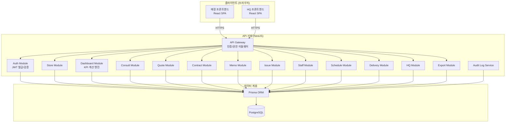

### 인증/인가 흐름

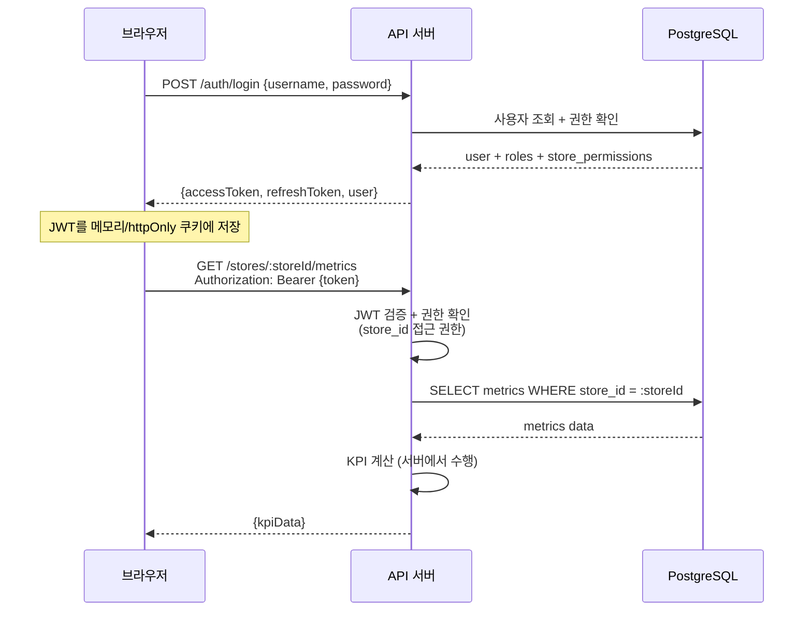

### 핵심 설계 원칙

| 원칙 | 구현 방법 |
|---|---|
| 브라우저 → DB 직접 접근 금지 | 모든 요청은 API 서버를 경유 |
| KPI 계산은 서버에서 수행 | Dashboard Module에서 SQL 집계 + 비즈니스 로직 |
| 인증/권한은 서버 중심 | JWT + RBAC Guard + store_id 기반 접근 제어 |
| store_id 기준 데이터 분리 | 모든 쿼리에 store_id 조건 필수 (Prisma middleware) |
| 기존 기능 완전 매핑 | localStorage 키 → REST API 1:1 매핑 |

---

## 4. Domain Boundaries (도메인 경계)

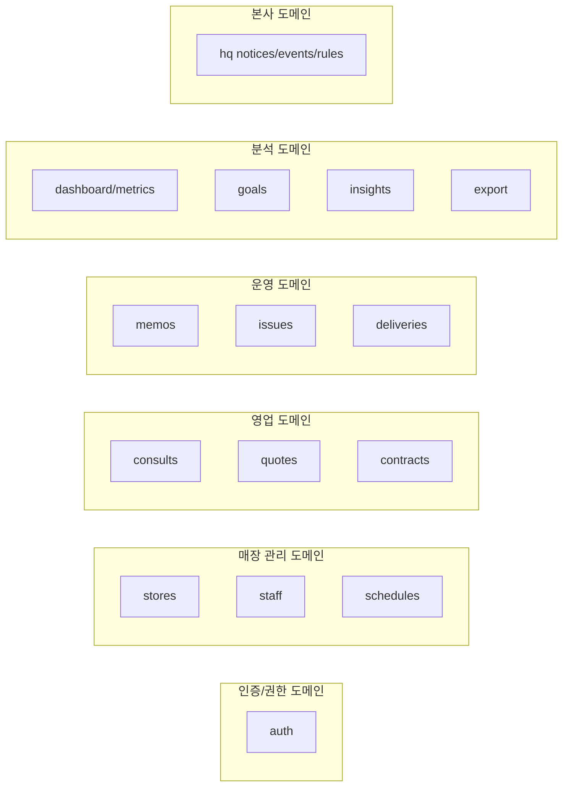


### 도메인별 책임

| 도메인 | 모듈 | 핵심 책임 | 접근 권한 |
|---|---|---|---|
| 인증/권한 | `AuthModule` | 로그인, JWT 발급/갱신, 권한 검증 | 전체 |
| 매장 관리 | `StoreModule` | 매장 CRUD, 매장 설정 | HQ_ADMIN, STORE_MANAGER |
| 직원 | `StaffModule` | 직원 정보 관리 | STORE_MANAGER, STORE_STAFF |
| 스케줄 | `ScheduleModule` | 근무 스케줄 관리 | STORE_MANAGER, STORE_STAFF |
| 상담 | `ConsultModule` | 고객 상담 기록 | STORE_MANAGER, STORE_STAFF |
| 견적 | `QuoteModule` | 견적서 생성/관리 | STORE_MANAGER, STORE_STAFF |
| 계약 | `ContractModule` | 계약 체결/취소 관리 | STORE_MANAGER, STORE_STAFF |
| 메모 | `MemoModule` | 매장 메모 관리 | STORE_MANAGER, STORE_STAFF |
| 이슈 | `IssueModule` | 이슈 트래킹 | 전체 (READONLY 읽기만) |
| 배송 | `DeliveryModule` | 배송 일정/상태 관리 | STORE_MANAGER, STORE_STAFF |
| 대시보드 | `DashboardModule` | KPI 계산, 지표 조회 | 전체 (READONLY 포함) |
| 목표 | `GoalModule` | 월간 목표 설정/조회 | STORE_MANAGER, HQ_ADMIN |
| 본사 | `HqModule` | 공지, 이벤트, 배송 규칙 | HQ_ADMIN (관리), 전체 (조회) |
| 인사이트 | `InsightModule` | 매장 간 비교 분석 | HQ_ADMIN |
| 내보내기 | `ExportModule` | 데이터 CSV/Excel 내보내기 | STORE_MANAGER, HQ_ADMIN |

---

## 5. ERD Draft (ERD 초안)

### 전체 ERD 다이어그램

```mermaid
erDiagram
    users ||--o{ user_store_permissions : "has"
    users ||--o{ roles : "has"
    stores ||--o{ user_store_permissions : "grants"
    stores ||--o{ store_auth : "has"
    stores ||--o{ monthly_metrics : "tracks"
    stores ||--o{ monthly_goals : "sets"
    stores ||--o{ consults : "records"
    stores ||--o{ quotes : "creates"
    stores ||--o{ contracts : "signs"
    stores ||--o{ memos : "writes"
    stores ||--o{ issues : "reports"
    stores ||--o{ staffs : "employs"
    stores ||--o{ schedules : "plans"
    stores ||--o{ deliveries : "receives"
    quotes ||--o{ quote_items : "contains"
    contracts ||--o{ contract_items : "contains"
    contracts ||--o{ contract_cancellations : "may_cancel"
    consults ||--o| quotes : "may_generate"

    users {
        uuid id PK
        string username UK
        string password_hash
        string name
        string email
        enum role "HQ_ADMIN|STORE_MANAGER|STORE_STAFF|READONLY"
        boolean is_active
        timestamp created_at
        timestamp updated_at
    }

    roles {
        uuid id PK
        uuid user_id FK
        enum role_name "HQ_ADMIN|STORE_MANAGER|STORE_STAFF|READONLY"
        timestamp assigned_at
    }

    user_store_permissions {
        uuid id PK
        uuid user_id FK
        uuid store_id FK
        enum permission_level "MANAGE|VIEW|NONE"
        timestamp granted_at
        uuid granted_by FK
    }

    stores {
        uuid id PK
        string name
        string code UK
        string address
        string phone
        string region
        boolean is_active
        jsonb settings
        timestamp created_at
        timestamp updated_at
    }

    store_auth {
        uuid id PK
        uuid store_id FK
        string pin_hash
        timestamp updated_at
        uuid updated_by FK
    }

    monthly_metrics {
        uuid id PK
        uuid store_id FK
        int year
        int month
        int visit_count
        int consult_count
        int quote_count
        int contract_count
        decimal contract_amount
        decimal conversion_rate "계산 필드"
        decimal avg_order_value "계산 필드"
        jsonb collection_breakdown "SATI|QUERENCIA|MILO|BONUM|VARD|ELMER"
        timestamp calculated_at
        timestamp created_at
    }

    monthly_goals {
        uuid id PK
        uuid store_id FK
        int year
        int month
        decimal target_amount
        int target_contracts
        int target_consults
        jsonb custom_goals
        uuid created_by FK
        timestamp created_at
        timestamp updated_at
    }

    consults {
        uuid id PK
        uuid store_id FK
        string customer_name
        string customer_phone
        string customer_email
        text notes
        enum status "PENDING|IN_PROGRESS|COMPLETED|CANCELLED"
        date consult_date
        uuid assigned_to FK
        uuid created_by FK
        timestamp created_at
        timestamp updated_at
    }

    quotes {
        uuid id PK
        uuid store_id FK
        uuid consult_id FK "nullable"
        string quote_number UK
        string customer_name
        decimal total_amount
        enum status "DRAFT|SENT|ACCEPTED|REJECTED|EXPIRED"
        date valid_until
        uuid created_by FK
        timestamp created_at
        timestamp updated_at
    }

    quote_items {
        uuid id PK
        uuid quote_id FK
        string product_name
        enum collection "SATI|QUERENCIA|MILO|BONUM|VARD|ELMER"
        int quantity
        decimal unit_price
        decimal total_price
        text notes
    }

    contracts {
        uuid id PK
        uuid store_id FK
        uuid quote_id FK "nullable"
        string contract_number UK
        string customer_name
        decimal total_amount
        enum status "ACTIVE|COMPLETED|CANCELLED"
        date contract_date
        date delivery_date
        uuid created_by FK
        timestamp created_at
        timestamp updated_at
    }

    contract_items {
        uuid id PK
        uuid contract_id FK
        string product_name
        enum collection "SATI|QUERENCIA|MILO|BONUM|VARD|ELMER"
        int quantity
        decimal unit_price
        decimal total_price
    }

    contract_cancellations {
        uuid id PK
        uuid contract_id FK
        text reason
        decimal refund_amount
        date cancelled_date
        uuid cancelled_by FK
        timestamp created_at
    }

    memos {
        uuid id PK
        uuid store_id FK
        string title
        text content
        enum category "GENERAL|IMPORTANT|TODO"
        boolean is_pinned
        uuid created_by FK
        timestamp created_at
        timestamp updated_at
    }

    issues {
        uuid id PK
        uuid store_id FK
        string title
        text description
        enum priority "LOW|MEDIUM|HIGH|CRITICAL"
        enum status "OPEN|IN_PROGRESS|RESOLVED|CLOSED"
        uuid assigned_to FK
        uuid created_by FK
        timestamp created_at
        timestamp updated_at
    }

    staffs {
        uuid id PK
        uuid store_id FK
        string name
        string phone
        string position
        date hire_date
        boolean is_active
        timestamp created_at
        timestamp updated_at
    }

    schedules {
        uuid id PK
        uuid store_id FK
        uuid staff_id FK
        date work_date
        time start_time
        time end_time
        enum shift_type "MORNING|AFTERNOON|FULL|OFF"
        text notes
        timestamp created_at
    }

    deliveries {
        uuid id PK
        uuid store_id FK
        uuid contract_id FK "nullable"
        string customer_name
        date scheduled_date
        date actual_date "nullable"
        enum status "SCHEDULED|IN_TRANSIT|DELIVERED|FAILED"
        text address
        text notes
        uuid created_by FK
        timestamp created_at
        timestamp updated_at
    }

    hq_notices {
        uuid id PK
        string title
        text content
        enum priority "NORMAL|IMPORTANT|URGENT"
        boolean is_published
        date publish_date
        uuid created_by FK
        timestamp created_at
        timestamp updated_at
    }

    hq_events {
        uuid id PK
        string title
        text description
        date start_date
        date end_date
        boolean is_active
        jsonb target_stores "대상 매장 목록"
        uuid created_by FK
        timestamp created_at
    }

    hq_delivery_rules {
        uuid id PK
        string rule_name
        text description
        jsonb conditions
        boolean is_active
        uuid created_by FK
        timestamp created_at
        timestamp updated_at
    }

    audit_logs {
        uuid id PK
        uuid user_id FK
        uuid store_id FK "nullable"
        string action
        string resource_type
        uuid resource_id
        jsonb old_value
        jsonb new_value
        string ip_address
        timestamp created_at
    }
```

### 핵심 제약 조건

- 모든 매장 관련 테이블은 `store_id` FK 필수 (NOT NULL)
- `monthly_metrics`는 `(store_id, year, month)` UNIQUE 제약
- `monthly_goals`는 `(store_id, year, month)` UNIQUE 제약
- `quotes.quote_number`, `contracts.contract_number`는 UNIQUE
- `contract_cancellations`는 `contract_id` 당 최대 1건
- `audit_logs`는 INSERT ONLY (UPDATE/DELETE 불가)
- 모든 테이블의 `id`는 UUID v4
- `collection` enum: `SATI | QUERENCIA | MILO | BONUM | VARD | ELMER`

---

## 6. REST API Draft (REST API 초안)

### 인증 API

| Method | Endpoint | 설명 | 권한 |
|---|---|---|---|
| POST | `/auth/login` | 로그인 (JWT 발급) | Public |
| POST | `/auth/refresh` | 토큰 갱신 | Authenticated |
| POST | `/auth/logout` | 로그아웃 | Authenticated |
| GET | `/auth/me` | 현재 사용자 정보 | Authenticated |
| PUT | `/auth/password` | 비밀번호 변경 | Authenticated |

### 매장 API

| Method | Endpoint | 설명 | 권한 |
|---|---|---|---|
| GET | `/stores` | 매장 목록 | HQ_ADMIN |
| POST | `/stores` | 매장 생성 | HQ_ADMIN |
| GET | `/stores/:storeId` | 매장 상세 | STORE_MANAGER+ |
| PUT | `/stores/:storeId` | 매장 수정 | HQ_ADMIN |
| DELETE | `/stores/:storeId` | 매장 비활성화 | HQ_ADMIN |

### 대시보드/지표 API

| Method | Endpoint | 설명 | 권한 |
|---|---|---|---|
| GET | `/stores/:storeId/metrics` | 월간 지표 조회 | READONLY+ |
| GET | `/stores/:storeId/metrics/:year/:month` | 특정 월 지표 | READONLY+ |
| POST | `/stores/:storeId/metrics/recalculate` | KPI 재계산 | STORE_MANAGER+ |
| GET | `/stores/:storeId/kpi/summary` | KPI 요약 | READONLY+ |

### 목표 API

| Method | Endpoint | 설명 | 권한 |
|---|---|---|---|
| GET | `/stores/:storeId/goals` | 목표 목록 | READONLY+ |
| GET | `/stores/:storeId/goals/:year/:month` | 특정 월 목표 | READONLY+ |
| POST | `/stores/:storeId/goals` | 목표 설정 | STORE_MANAGER+ |
| PUT | `/stores/:storeId/goals/:goalId` | 목표 수정 | STORE_MANAGER+ |

### 상담 API

| Method | Endpoint | 설명 | 권한 |
|---|---|---|---|
| GET | `/stores/:storeId/consults` | 상담 목록 | STORE_STAFF+ |
| POST | `/stores/:storeId/consults` | 상담 등록 | STORE_STAFF+ |
| GET | `/stores/:storeId/consults/:id` | 상담 상세 | STORE_STAFF+ |
| PUT | `/stores/:storeId/consults/:id` | 상담 수정 | STORE_STAFF+ |
| DELETE | `/stores/:storeId/consults/:id` | 상담 삭제 | STORE_MANAGER+ |

### 견적 API

| Method | Endpoint | 설명 | 권한 |
|---|---|---|---|
| GET | `/stores/:storeId/quotes` | 견적 목록 | STORE_STAFF+ |
| POST | `/stores/:storeId/quotes` | 견적 생성 | STORE_STAFF+ |
| GET | `/stores/:storeId/quotes/:id` | 견적 상세 | STORE_STAFF+ |
| PUT | `/stores/:storeId/quotes/:id` | 견적 수정 | STORE_STAFF+ |
| DELETE | `/stores/:storeId/quotes/:id` | 견적 삭제 | STORE_MANAGER+ |

### 계약 API

| Method | Endpoint | 설명 | 권한 |
|---|---|---|---|
| GET | `/stores/:storeId/contracts` | 계약 목록 | STORE_STAFF+ |
| POST | `/stores/:storeId/contracts` | 계약 생성 | STORE_STAFF+ |
| GET | `/stores/:storeId/contracts/:id` | 계약 상세 | STORE_STAFF+ |
| PUT | `/stores/:storeId/contracts/:id` | 계약 수정 | STORE_MANAGER+ |
| POST | `/stores/:storeId/contracts/:id/cancel` | 계약 취소 | STORE_MANAGER+ |

### 메모 API

| Method | Endpoint | 설명 | 권한 |
|---|---|---|---|
| GET | `/stores/:storeId/memos` | 메모 목록 | STORE_STAFF+ |
| POST | `/stores/:storeId/memos` | 메모 생성 | STORE_STAFF+ |
| PUT | `/stores/:storeId/memos/:id` | 메모 수정 | STORE_STAFF+ |
| DELETE | `/stores/:storeId/memos/:id` | 메모 삭제 | STORE_MANAGER+ |

### 이슈 API

| Method | Endpoint | 설명 | 권한 |
|---|---|---|---|
| GET | `/stores/:storeId/issues` | 이슈 목록 | READONLY+ |
| POST | `/stores/:storeId/issues` | 이슈 생성 | STORE_STAFF+ |
| PUT | `/stores/:storeId/issues/:id` | 이슈 수정 | STORE_STAFF+ |
| PATCH | `/stores/:storeId/issues/:id/status` | 상태 변경 | STORE_MANAGER+ |

### 직원 API

| Method | Endpoint | 설명 | 권한 |
|---|---|---|---|
| GET | `/stores/:storeId/staffs` | 직원 목록 | STORE_STAFF+ |
| POST | `/stores/:storeId/staffs` | 직원 등록 | STORE_MANAGER+ |
| PUT | `/stores/:storeId/staffs/:id` | 직원 수정 | STORE_MANAGER+ |
| DELETE | `/stores/:storeId/staffs/:id` | 직원 비활성화 | STORE_MANAGER+ |

### 스케줄 API

| Method | Endpoint | 설명 | 권한 |
|---|---|---|---|
| GET | `/stores/:storeId/schedules` | 스케줄 조회 | STORE_STAFF+ |
| POST | `/stores/:storeId/schedules` | 스케줄 등록 | STORE_MANAGER+ |
| PUT | `/stores/:storeId/schedules/:id` | 스케줄 수정 | STORE_MANAGER+ |
| DELETE | `/stores/:storeId/schedules/:id` | 스케줄 삭제 | STORE_MANAGER+ |

### 배송 API

| Method | Endpoint | 설명 | 권한 |
|---|---|---|---|
| GET | `/stores/:storeId/deliveries` | 배송 목록 | STORE_STAFF+ |
| POST | `/stores/:storeId/deliveries` | 배송 등록 | STORE_STAFF+ |
| PUT | `/stores/:storeId/deliveries/:id` | 배송 수정 | STORE_STAFF+ |
| PATCH | `/stores/:storeId/deliveries/:id/status` | 배송 상태 변경 | STORE_STAFF+ |

### HQ API

| Method | Endpoint | 설명 | 권한 |
|---|---|---|---|
| GET | `/hq/notices` | 공지 목록 | Authenticated |
| POST | `/hq/notices` | 공지 생성 | HQ_ADMIN |
| PUT | `/hq/notices/:id` | 공지 수정 | HQ_ADMIN |
| DELETE | `/hq/notices/:id` | 공지 삭제 | HQ_ADMIN |
| GET | `/hq/events` | 이벤트 목록 | Authenticated |
| POST | `/hq/events` | 이벤트 생성 | HQ_ADMIN |
| PUT | `/hq/events/:id` | 이벤트 수정 | HQ_ADMIN |
| GET | `/hq/delivery-rules` | 배송 규칙 | Authenticated |
| POST | `/hq/delivery-rules` | 배송 규칙 생성 | HQ_ADMIN |
| PUT | `/hq/delivery-rules/:id` | 배송 규칙 수정 | HQ_ADMIN |

### 인사이트 API

| Method | Endpoint | 설명 | 권한 |
|---|---|---|---|
| GET | `/insights/stores/comparison` | 매장 간 비교 | HQ_ADMIN |
| GET | `/insights/kpi/trends` | KPI 트렌드 | HQ_ADMIN |
| GET | `/insights/collections/analysis` | 컬렉션별 분석 | HQ_ADMIN |

### 내보내기 API

| Method | Endpoint | 설명 | 권한 |
|---|---|---|---|
| GET | `/stores/:storeId/export/:resource` | 리소스별 내보내기 | STORE_MANAGER+ |
| GET | `/hq/export/:resource` | HQ 데이터 내보내기 | HQ_ADMIN |


---

## 7. Backend Folder Structure (백엔드 폴더 구조)

```
backend/
├── prisma/
│   ├── schema.prisma
│   ├── migrations/
│   └── seed.ts
├── src/
│   ├── main.ts
│   ├── app.module.ts
│   ├── common/
│   │   ├── decorators/
│   │   │   ├── current-user.decorator.ts
│   │   │   ├── roles.decorator.ts
│   │   │   └── store-access.decorator.ts
│   │   ├── guards/
│   │   │   ├── jwt-auth.guard.ts
│   │   │   ├── roles.guard.ts
│   │   │   └── store-access.guard.ts
│   │   ├── interceptors/
│   │   │   └── audit-log.interceptor.ts
│   │   ├── middleware/
│   │   │   └── store-context.middleware.ts
│   │   ├── filters/
│   │   │   └── http-exception.filter.ts
│   │   ├── pipes/
│   │   │   └── uuid-validation.pipe.ts
│   │   └── types/
│   │       ├── roles.enum.ts
│   │       └── collections.enum.ts
│   ├── modules/
│   │   ├── auth/
│   │   │   ├── auth.module.ts
│   │   │   ├── auth.controller.ts
│   │   │   ├── auth.service.ts
│   │   │   ├── strategies/
│   │   │   │   ├── jwt.strategy.ts
│   │   │   │   └── local.strategy.ts
│   │   │   └── dto/
│   │   │       ├── login.dto.ts
│   │   │       └── token-response.dto.ts
│   │   ├── stores/
│   │   │   ├── stores.module.ts
│   │   │   ├── stores.controller.ts
│   │   │   ├── stores.service.ts
│   │   │   └── dto/
│   │   ├── dashboard/
│   │   │   ├── dashboard.module.ts
│   │   │   ├── dashboard.controller.ts
│   │   │   ├── dashboard.service.ts
│   │   │   ├── kpi-calculator.service.ts
│   │   │   └── dto/
│   │   ├── goals/
│   │   │   ├── goals.module.ts
│   │   │   ├── goals.controller.ts
│   │   │   ├── goals.service.ts
│   │   │   └── dto/
│   │   ├── consults/
│   │   │   ├── consults.module.ts
│   │   │   ├── consults.controller.ts
│   │   │   ├── consults.service.ts
│   │   │   └── dto/
│   │   ├── quotes/
│   │   │   ├── quotes.module.ts
│   │   │   ├── quotes.controller.ts
│   │   │   ├── quotes.service.ts
│   │   │   └── dto/
│   │   ├── contracts/
│   │   │   ├── contracts.module.ts
│   │   │   ├── contracts.controller.ts
│   │   │   ├── contracts.service.ts
│   │   │   └── dto/
│   │   ├── memos/
│   │   │   ├── memos.module.ts
│   │   │   ├── memos.controller.ts
│   │   │   ├── memos.service.ts
│   │   │   └── dto/
│   │   ├── issues/
│   │   │   ├── issues.module.ts
│   │   │   ├── issues.controller.ts
│   │   │   ├── issues.service.ts
│   │   │   └── dto/
│   │   ├── staffs/
│   │   │   ├── staffs.module.ts
│   │   │   ├── staffs.controller.ts
│   │   │   ├── staffs.service.ts
│   │   │   └── dto/
│   │   ├── schedules/
│   │   │   ├── schedules.module.ts
│   │   │   ├── schedules.controller.ts
│   │   │   ├── schedules.service.ts
│   │   │   └── dto/
│   │   ├── deliveries/
│   │   │   ├── deliveries.module.ts
│   │   │   ├── deliveries.controller.ts
│   │   │   ├── deliveries.service.ts
│   │   │   └── dto/
│   │   ├── hq/
│   │   │   ├── hq.module.ts
│   │   │   ├── hq.controller.ts
│   │   │   ├── hq.service.ts
│   │   │   └── dto/
│   │   ├── insights/
│   │   │   ├── insights.module.ts
│   │   │   ├── insights.controller.ts
│   │   │   ├── insights.service.ts
│   │   │   └── dto/
│   │   └── export/
│   │       ├── export.module.ts
│   │       ├── export.controller.ts
│   │       └── export.service.ts
│   └── prisma/
│       ├── prisma.module.ts
│       └── prisma.service.ts
├── test/
│   ├── e2e/
│   └── unit/
├── .env
├── .env.example
├── nest-cli.json
├── package.json
└── tsconfig.json
```

---

## 8. Frontend Folder Structure (프론트엔드 폴더 구조)

```
frontend/
├── public/
├── src/
│   ├── main.tsx
│   ├── App.tsx
│   ├── api/
│   │   ├── client.ts                 # Axios 인스턴스 (JWT 인터셉터)
│   │   ├── auth.api.ts
│   │   ├── stores.api.ts
│   │   ├── dashboard.api.ts
│   │   ├── quotes.api.ts
│   │   ├── contracts.api.ts
│   │   └── ...api.ts
│   ├── hooks/
│   │   ├── useAuth.ts
│   │   ├── useStore.ts
│   │   ├── useDashboard.ts
│   │   └── ...ts
│   ├── stores/                        # 상태 관리 (Zustand 또는 Context)
│   │   ├── authStore.ts
│   │   └── storeContext.ts
│   ├── components/
│   │   ├── common/
│   │   │   ├── Layout.tsx
│   │   │   ├── Sidebar.tsx
│   │   │   ├── Header.tsx
│   │   │   ├── ProtectedRoute.tsx
│   │   │   └── RoleGuard.tsx
│   │   ├── dashboard/
│   │   │   ├── KpiCards.tsx
│   │   │   ├── MetricsChart.tsx
│   │   │   └── GoalProgress.tsx
│   │   ├── quotes/
│   │   │   ├── QuoteList.tsx
│   │   │   ├── QuoteForm.tsx
│   │   │   └── QuoteDetail.tsx
│   │   ├── contracts/
│   │   │   ├── ContractList.tsx
│   │   │   ├── ContractForm.tsx
│   │   │   └── ContractDetail.tsx
│   │   └── .../
│   ├── pages/
│   │   ├── LoginPage.tsx
│   │   ├── store/
│   │   │   ├── DashboardPage.tsx
│   │   │   ├── ConsultsPage.tsx
│   │   │   ├── QuotesPage.tsx
│   │   │   ├── ContractsPage.tsx
│   │   │   ├── MemosPage.tsx
│   │   │   ├── IssuesPage.tsx
│   │   │   ├── StaffsPage.tsx
│   │   │   ├── SchedulesPage.tsx
│   │   │   └── DeliveriesPage.tsx
│   │   └── hq/
│   │       ├── HqDashboardPage.tsx
│   │       ├── StoreManagementPage.tsx
│   │       ├── NoticesPage.tsx
│   │       ├── EventsPage.tsx
│   │       └── InsightsPage.tsx
│   ├── types/
│   │   ├── auth.types.ts
│   │   ├── store.types.ts
│   │   ├── quote.types.ts
│   │   ├── contract.types.ts
│   │   └── ...types.ts
│   └── utils/
│       ├── formatters.ts
│       └── validators.ts
├── .env
├── package.json
├── tsconfig.json
└── vite.config.ts
```


---

## Core Interfaces/Types (핵심 인터페이스 및 타입)

### 역할 및 권한 타입

```typescript
// common/types/roles.enum.ts
enum Role {
  HQ_ADMIN = 'HQ_ADMIN',
  STORE_MANAGER = 'STORE_MANAGER',
  STORE_STAFF = 'STORE_STAFF',
  READONLY = 'READONLY',
}

enum PermissionLevel {
  MANAGE = 'MANAGE',
  VIEW = 'VIEW',
  NONE = 'NONE',
}

enum Collection {
  SATI = 'SATI',
  QUERENCIA = 'QUERENCIA',
  MILO = 'MILO',
  BONUM = 'BONUM',
  VARD = 'VARD',
  ELMER = 'ELMER',
}

// 역할 계층 (높은 권한 → 낮은 권한)
const ROLE_HIERARCHY: Record<Role, number> = {
  [Role.HQ_ADMIN]: 4,
  [Role.STORE_MANAGER]: 3,
  [Role.STORE_STAFF]: 2,
  [Role.READONLY]: 1,
};

interface JwtPayload {
  sub: string;        // user.id
  username: string;
  role: Role;
  storePermissions: { storeId: string; level: PermissionLevel }[];
  iat: number;
  exp: number;
}

interface AuthenticatedUser {
  id: string;
  username: string;
  role: Role;
  storePermissions: Map<string, PermissionLevel>;
}
```

### KPI 관련 타입

```typescript
// modules/dashboard/types.ts
interface KpiResult {
  storeId: string;
  year: number;
  month: number;
  quoteCount: number;
  contractCount: number;        // 취소 제외
  contractAmount: number;       // 계약 매출 합계
  conversionRate: number;       // 계약 수 / 견적 수
  avgOrderValue: number;        // 계약 매출 / 계약 수
  collectionBreakdown: CollectionBreakdown;
}

interface CollectionBreakdown {
  [Collection.SATI]: CollectionMetric;
  [Collection.QUERENCIA]: CollectionMetric;
  [Collection.MILO]: CollectionMetric;
  [Collection.BONUM]: CollectionMetric;
  [Collection.VARD]: CollectionMetric;
  [Collection.ELMER]: CollectionMetric;
}

interface CollectionMetric {
  contractCount: number;
  totalAmount: number;
  itemCount: number;
}

interface MonthlyGoalComparison {
  goal: MonthlyGoal;
  actual: KpiResult;
  achievementRate: {
    amount: number;       // actual.contractAmount / goal.targetAmount * 100
    contracts: number;    // actual.contractCount / goal.targetContracts * 100
    consults: number;     // actual.consultCount / goal.targetConsults * 100
  };
}
```

---

## Key Functions with Formal Specifications (핵심 함수 및 형식 명세)

### KPI 계산 엔진

```typescript
// modules/dashboard/kpi-calculator.service.ts

class KpiCalculatorService {
  /**
   * 특정 매장의 월간 KPI를 계산한다.
   * 
   * @precondition storeId는 유효한 UUID이며 stores 테이블에 존재
   * @precondition year >= 2020 && month >= 1 && month <= 12
   * @postcondition result.conversionRate = result.contractCount / result.quoteCount (quoteCount > 0일 때)
   * @postcondition result.avgOrderValue = result.contractAmount / result.contractCount (contractCount > 0일 때)
   * @postcondition result.contractCount는 취소된 계약을 제외한 수
   * @postcondition result.collectionBreakdown의 모든 컬렉션 합계 = result.contractAmount
   */
  async calculateMonthlyKpi(storeId: string, year: number, month: number): Promise<KpiResult>;

  /**
   * 컬렉션별 매출 분석을 수행한다.
   * 
   * @precondition storeId는 유효한 UUID
   * @postcondition 반환된 breakdown의 각 컬렉션 totalAmount >= 0
   * @postcondition 모든 컬렉션 totalAmount 합계 = 해당 기간 전체 계약 매출
   */
  async calculateCollectionBreakdown(storeId: string, year: number, month: number): Promise<CollectionBreakdown>;
}
```

### 인증/인가 서비스

```typescript
// modules/auth/auth.service.ts

class AuthService {
  /**
   * 사용자 로그인을 처리하고 JWT 토큰을 발급한다.
   * 
   * @precondition username은 비어있지 않은 문자열
   * @precondition password는 비어있지 않은 문자열
   * @postcondition 성공 시: 유효한 accessToken과 refreshToken 반환
   * @postcondition 실패 시: UnauthorizedException 발생
   * @postcondition audit_logs에 로그인 시도 기록
   */
  async login(username: string, password: string): Promise<TokenResponse>;

  /**
   * 사용자의 특정 매장 접근 권한을 검증한다.
   * 
   * @precondition user는 인증된 사용자
   * @precondition storeId는 유효한 UUID
   * @postcondition HQ_ADMIN은 모든 매장 접근 가능
   * @postcondition STORE_MANAGER/STORE_STAFF는 user_store_permissions에 등록된 매장만 접근
   * @postcondition READONLY는 VIEW 권한이 있는 매장만 접근
   */
  async validateStoreAccess(user: AuthenticatedUser, storeId: string, requiredLevel: PermissionLevel): Promise<boolean>;
}
```

### Store Access Guard

```typescript
// common/guards/store-access.guard.ts

class StoreAccessGuard implements CanActivate {
  /**
   * 요청의 storeId 파라미터에 대한 접근 권한을 검증한다.
   * 
   * @precondition 요청에 유효한 JWT 토큰이 포함
   * @precondition URL 파라미터에 storeId가 존재
   * @postcondition 권한 있음: true 반환, 요청 진행
   * @postcondition 권한 없음: ForbiddenException 발생
   * @invariant store_id가 없는 요청은 이 Guard를 통과하지 않음
   */
  async canActivate(context: ExecutionContext): Promise<boolean>;
}
```

---

## Algorithmic Pseudocode (알고리즘 의사코드)

### KPI 계산 알고리즘

```typescript
// 서버 KPI 계산 - 핵심 알고리즘
async function calculateMonthlyKpi(storeId: string, year: number, month: number): Promise<KpiResult> {
  // ASSERT: storeId가 stores 테이블에 존재
  const store = await prisma.stores.findUniqueOrThrow({ where: { id: storeId } });

  const startDate = new Date(year, month - 1, 1);
  const endDate = new Date(year, month, 0); // 해당 월 마지막 날

  // Step 1: 견적 수 집계
  const quoteCount = await prisma.quotes.count({
    where: {
      store_id: storeId,
      created_at: { gte: startDate, lte: endDate },
    },
  });

  // Step 2: 계약 집계 (취소 제외)
  const contracts = await prisma.contracts.findMany({
    where: {
      store_id: storeId,
      contract_date: { gte: startDate, lte: endDate },
      status: { not: 'CANCELLED' },
    },
    include: { contract_items: true },
  });

  const contractCount = contracts.length;
  const contractAmount = contracts.reduce((sum, c) => sum + Number(c.total_amount), 0);

  // Step 3: 파생 KPI 계산
  // POSTCONDITION: quoteCount가 0이면 conversionRate = 0
  const conversionRate = quoteCount > 0 ? contractCount / quoteCount : 0;
  // POSTCONDITION: contractCount가 0이면 avgOrderValue = 0
  const avgOrderValue = contractCount > 0 ? contractAmount / contractCount : 0;

  // Step 4: 컬렉션별 분류
  const collectionBreakdown = buildCollectionBreakdown(contracts);
  // ASSERT: 모든 컬렉션 totalAmount 합계 === contractAmount

  // Step 5: monthly_metrics 테이블에 저장 (upsert)
  await prisma.monthly_metrics.upsert({
    where: {
      store_id_year_month: { store_id: storeId, year, month },
    },
    update: {
      quote_count: quoteCount,
      contract_count: contractCount,
      contract_amount: contractAmount,
      conversion_rate: conversionRate,
      avg_order_value: avgOrderValue,
      collection_breakdown: collectionBreakdown,
      calculated_at: new Date(),
    },
    create: {
      store_id: storeId,
      year,
      month,
      quote_count: quoteCount,
      contract_count: contractCount,
      contract_amount: contractAmount,
      conversion_rate: conversionRate,
      avg_order_value: avgOrderValue,
      collection_breakdown: collectionBreakdown,
      calculated_at: new Date(),
    },
  });

  return {
    storeId, year, month,
    quoteCount, contractCount, contractAmount,
    conversionRate, avgOrderValue, collectionBreakdown,
  };
}
```

### 컬렉션별 분류 알고리즘

```typescript
function buildCollectionBreakdown(contracts: ContractWithItems[]): CollectionBreakdown {
  const breakdown: CollectionBreakdown = {
    SATI: { contractCount: 0, totalAmount: 0, itemCount: 0 },
    QUERENCIA: { contractCount: 0, totalAmount: 0, itemCount: 0 },
    MILO: { contractCount: 0, totalAmount: 0, itemCount: 0 },
    BONUM: { contractCount: 0, totalAmount: 0, itemCount: 0 },
    VARD: { contractCount: 0, totalAmount: 0, itemCount: 0 },
    ELMER: { contractCount: 0, totalAmount: 0, itemCount: 0 },
  };

  // LOOP INVARIANT: 처리된 모든 아이템의 금액 합계가 정확히 추적됨
  for (const contract of contracts) {
    const collectionsInContract = new Set<string>();

    for (const item of contract.contract_items) {
      const collection = item.collection as Collection;
      breakdown[collection].totalAmount += Number(item.total_price);
      breakdown[collection].itemCount += item.quantity;
      collectionsInContract.add(collection);
    }

    // 해당 계약이 포함하는 각 컬렉션의 contractCount 증가
    for (const col of collectionsInContract) {
      breakdown[col as Collection].contractCount += 1;
    }
  }

  return breakdown;
}
```

### 권한 검증 알고리즘

```typescript
async function validateStoreAccess(
  user: AuthenticatedUser,
  storeId: string,
  requiredLevel: PermissionLevel
): Promise<boolean> {
  // Rule 1: HQ_ADMIN은 모든 매장에 MANAGE 권한
  if (user.role === Role.HQ_ADMIN) {
    return true;
  }

  // Rule 2: user_store_permissions에서 해당 매장 권한 조회
  const permission = user.storePermissions.get(storeId);

  if (!permission || permission === PermissionLevel.NONE) {
    return false;
  }

  // Rule 3: 요구 권한 수준 비교
  // MANAGE > VIEW > NONE
  if (requiredLevel === PermissionLevel.MANAGE) {
    return permission === PermissionLevel.MANAGE;
  }

  if (requiredLevel === PermissionLevel.VIEW) {
    return permission === PermissionLevel.MANAGE || permission === PermissionLevel.VIEW;
  }

  return false;
}
```

### Audit Log 인터셉터 알고리즘

```typescript
// 모든 CUD 작업에 대해 감사 로그를 자동 기록
async function auditLogIntercept(context: ExecutionContext, next: CallHandler): Promise<Observable<any>> {
  const request = context.switchToHttp().getRequest();
  const user = request.user as AuthenticatedUser;
  const method = request.method;

  // GET 요청은 감사 로그 제외
  if (method === 'GET') {
    return next.handle();
  }

  const storeId = request.params.storeId || null;
  const resourceType = extractResourceType(request.path);

  // 요청 전 상태 캡처 (UPDATE/DELETE의 경우)
  const oldValue = method !== 'POST' ? await captureCurrentState(resourceType, request.params.id) : null;

  return next.handle().pipe(
    tap(async (responseData) => {
      await prisma.audit_logs.create({
        data: {
          user_id: user.id,
          store_id: storeId,
          action: method,
          resource_type: resourceType,
          resource_id: responseData?.id || request.params.id,
          old_value: oldValue,
          new_value: method !== 'DELETE' ? responseData : null,
          ip_address: request.ip,
        },
      });
    }),
  );
}
```

---

## Example Usage (사용 예시)

### 로그인 → 대시보드 조회 흐름

```typescript
// 1. 로그인
const loginResponse = await fetch('/auth/login', {
  method: 'POST',
  headers: { 'Content-Type': 'application/json' },
  body: JSON.stringify({ username: 'manager01', password: 'securePass' }),
});
const { accessToken, user } = await loginResponse.json();
// user = { id: 'uuid', role: 'STORE_MANAGER', storePermissions: [...] }

// 2. 매장 KPI 조회 (서버에서 계산된 결과)
const storeId = user.storePermissions[0].storeId;
const metricsResponse = await fetch(`/stores/${storeId}/metrics/2025/1`, {
  headers: { Authorization: `Bearer ${accessToken}` },
});
const kpi = await metricsResponse.json();
// kpi = { quoteCount: 45, contractCount: 12, contractAmount: 58000000,
//         conversionRate: 0.267, avgOrderValue: 4833333, collectionBreakdown: {...} }

// 3. 견적 생성
const quoteResponse = await fetch(`/stores/${storeId}/quotes`, {
  method: 'POST',
  headers: {
    'Content-Type': 'application/json',
    Authorization: `Bearer ${accessToken}`,
  },
  body: JSON.stringify({
    customerName: '홍길동',
    items: [
      { productName: '소파 A', collection: 'SATI', quantity: 1, unitPrice: 3500000 },
      { productName: '테이블 B', collection: 'QUERENCIA', quantity: 2, unitPrice: 1200000 },
    ],
    validUntil: '2025-02-28',
  }),
});

// 4. 견적 → 계약 전환
const contractResponse = await fetch(`/stores/${storeId}/contracts`, {
  method: 'POST',
  headers: {
    'Content-Type': 'application/json',
    Authorization: `Bearer ${accessToken}`,
  },
  body: JSON.stringify({
    quoteId: quoteResponse.id,
    customerName: '홍길동',
    contractDate: '2025-01-15',
    deliveryDate: '2025-03-01',
  }),
});
// → 서버에서 자동으로 KPI 재계산 트리거
```

### React 프론트엔드 사용 예시

```typescript
// hooks/useDashboard.ts
function useDashboard(storeId: string, year: number, month: number) {
  return useQuery({
    queryKey: ['dashboard', storeId, year, month],
    queryFn: () => dashboardApi.getMetrics(storeId, year, month),
    staleTime: 5 * 60 * 1000, // 5분 캐시
  });
}

// pages/store/DashboardPage.tsx
function DashboardPage() {
  const { storeId } = useParams();
  const [year, month] = useCurrentMonth();
  const { data: kpi, isLoading } = useDashboard(storeId, year, month);
  const { data: goals } = useGoals(storeId, year, month);

  if (isLoading) return <Spinner />;

  return (
    <Layout>
      <KpiCards kpi={kpi} />
      <GoalProgress goal={goals} actual={kpi} />
      <MetricsChart storeId={storeId} />
    </Layout>
  );
}
```


---

## 9. Migration Plan (마이그레이션 계획)

### 마이그레이션 흐름

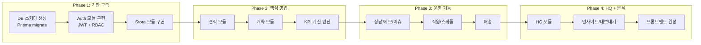

### localStorage 데이터 마이그레이션 전략

```typescript
// 기존 localStorage 데이터를 서버로 마이그레이션하는 일회성 스크립트

interface MigrationStep {
  localStorageKey: string;
  targetTable: string;
  transform: (data: any, storeId: string) => any[];
}

const MIGRATION_STEPS: MigrationStep[] = [
  {
    localStorageKey: 'alloso_extra_stores',
    targetTable: 'stores',
    transform: (data, _) => data.map((s: any) => ({
      name: s.name,
      code: s.code,
      address: s.address,
      phone: s.phone,
      region: s.region,
      is_active: true,
    })),
  },
  {
    localStorageKey: 'alloso_quotes',
    targetTable: 'quotes',
    transform: (data, storeId) => data.map((q: any) => ({
      store_id: storeId,
      customer_name: q.customerName,
      total_amount: q.totalAmount,
      status: q.status || 'DRAFT',
      created_at: new Date(q.date),
    })),
  },
  {
    localStorageKey: 'alloso_contracts',
    targetTable: 'contracts',
    transform: (data, storeId) => data.map((c: any) => ({
      store_id: storeId,
      customer_name: c.customerName,
      total_amount: c.totalAmount,
      status: 'ACTIVE',
      contract_date: new Date(c.date),
    })),
  },
  {
    localStorageKey: 'alloso_cancelled',
    targetTable: 'contract_cancellations',
    transform: (data, _) => data.map((c: any) => ({
      contract_id: c.contractId, // 매핑 필요
      reason: c.reason,
      cancelled_date: new Date(c.date),
    })),
  },
  // ... 나머지 키도 동일 패턴
];

/**
 * 마이그레이션 실행
 * @precondition 서버 DB 스키마가 이미 생성되어 있음
 * @precondition 브라우저에서 실행 (localStorage 접근 필요)
 * @postcondition 모든 localStorage 데이터가 서버 DB에 저장됨
 * @postcondition 마이그레이션 완료 후 localStorage에 마이그레이션 완료 플래그 설정
 */
async function executeMigration(storeId: string, apiBaseUrl: string): Promise<void> {
  for (const step of MIGRATION_STEPS) {
    const raw = localStorage.getItem(step.localStorageKey);
    if (!raw) continue;

    const data = JSON.parse(raw);
    const transformed = step.transform(data, storeId);

    await fetch(`${apiBaseUrl}/migration/${step.targetTable}`, {
      method: 'POST',
      headers: { 'Content-Type': 'application/json' },
      body: JSON.stringify({ records: transformed }),
    });
  }

  localStorage.setItem('alloso_migration_complete', 'true');
}
```

---

## 10. Implementation Priority (구현 우선순위)

### Phase 1: 기반 (2주)
| 순서 | 작업 | 의존성 | 산출물 |
|---|---|---|---|
| 1.1 | Prisma 스키마 정의 + 마이그레이션 | 없음 | `schema.prisma`, 마이그레이션 파일 |
| 1.2 | NestJS 프로젝트 초기 설정 | 없음 | 프로젝트 구조, 공통 모듈 |
| 1.3 | Auth 모듈 (JWT + RBAC) | 1.1 | 로그인, 토큰 발급, Guard |
| 1.4 | Store 모듈 (CRUD) | 1.1, 1.3 | 매장 관리 API |
| 1.5 | Store Access Guard + Middleware | 1.3, 1.4 | store_id 기반 접근 제어 |
| 1.6 | Audit Log 인터셉터 | 1.1 | 자동 감사 로그 |

### Phase 2: 핵심 영업 (2주)
| 순서 | 작업 | 의존성 | 산출물 |
|---|---|---|---|
| 2.1 | 상담 모듈 | 1.4 | 상담 CRUD API |
| 2.2 | 견적 모듈 (+ quote_items) | 1.4 | 견적 CRUD API |
| 2.3 | 계약 모듈 (+ contract_items, cancellations) | 2.2 | 계약 CRUD + 취소 API |
| 2.4 | KPI 계산 엔진 | 2.2, 2.3 | 서버 KPI 계산 서비스 |
| 2.5 | 대시보드/지표 API | 2.4 | 월간 지표 조회 API |
| 2.6 | 목표 모듈 | 2.5 | 목표 설정/비교 API |

### Phase 3: 운영 기능 (1.5주)
| 순서 | 작업 | 의존성 | 산출물 |
|---|---|---|---|
| 3.1 | 메모 모듈 | 1.4 | 메모 CRUD API |
| 3.2 | 이슈 모듈 | 1.4 | 이슈 CRUD API |
| 3.3 | 직원 모듈 | 1.4 | 직원 관리 API |
| 3.4 | 스케줄 모듈 | 3.3 | 스케줄 관리 API |
| 3.5 | 배송 모듈 | 2.3 | 배송 관리 API |

### Phase 4: HQ + 프론트엔드 (2.5주)
| 순서 | 작업 | 의존성 | 산출물 |
|---|---|---|---|
| 4.1 | HQ 모듈 (공지/이벤트/규칙) | 1.3 | HQ 관리 API |
| 4.2 | 인사이트 모듈 | 2.5 | 매장 비교/분석 API |
| 4.3 | 내보내기 모듈 | 전체 | CSV/Excel 내보내기 |
| 4.4 | React 프론트엔드 - 매장 | 전체 백엔드 | 매장 SPA |
| 4.5 | React 프론트엔드 - HQ | 전체 백엔드 | HQ SPA |
| 4.6 | localStorage 마이그레이션 도구 | 전체 | 데이터 이관 스크립트 |

---

## 11. Risks and Mitigations (위험 요소 및 대응)

| 위험 | 영향도 | 발생 확률 | 대응 방안 |
|---|---|---|---|
| localStorage 데이터 유실 | 높음 | 중간 | 마이그레이션 전 localStorage 백업 스크립트 제공, 마이그레이션 검증 도구 구현 |
| store_id 누락으로 인한 데이터 혼재 | 높음 | 중간 | Prisma middleware에서 store_id 필수 검증, DB 레벨 NOT NULL 제약 |
| KPI 계산 정합성 오류 | 높음 | 낮음 | 기존 클라이언트 계산 결과와 서버 계산 결과 비교 테스트, property-based testing |
| JWT 토큰 탈취 | 높음 | 낮음 | httpOnly 쿠키 사용, 짧은 accessToken 만료(15분), refreshToken rotation |
| 권한 우회 | 높음 | 낮음 | Guard 단위 테스트 100% 커버리지, E2E 권한 테스트 |
| 대량 데이터 시 KPI 계산 성능 저하 | 중간 | 중간 | monthly_metrics 테이블에 계산 결과 캐싱, 인덱스 최적화 |
| 기존 HTML 기능 누락 | 중간 | 중간 | 기존 HTML 기능 체크리스트 작성, 기능별 매핑 검증 |
| 동시 접근 시 데이터 충돌 | 중간 | 낮음 | Prisma 트랜잭션 사용, optimistic locking (version 필드) |
| 마이그레이션 중 서비스 중단 | 중간 | 낮음 | 점진적 마이그레이션 (기존 HTML과 병행 운영 기간 설정) |

---

## Correctness Properties (정확성 속성)

*속성(Property)은 시스템의 모든 유효한 실행에서 참이어야 하는 특성 또는 동작이다. 속성은 사람이 읽을 수 있는 명세와 기계가 검증할 수 있는 정확성 보장 사이의 다리 역할을 한다.*

### Property 1: 매장 데이터 격리 (Store Data Isolation)

*For any* 매장 관련 API 응답과 *any* 요청된 storeId에 대해, 응답에 포함된 모든 데이터의 store_id는 요청한 storeId와 일치해야 한다.

**Validates: Requirements 3.5**

### Property 2: KPI 공식 정합성 (KPI Formula Correctness)

*For any* 매장과 *any* 월간 기간에 대해, KPI 계산 결과는 다음을 만족해야 한다:
- contractCount는 status가 CANCELLED가 아닌 계약만 포함
- quoteCount > 0일 때 conversionRate === contractCount / quoteCount
- contractCount > 0일 때 avgOrderValue === contractAmount / contractCount
- quoteCount === 0이면 conversionRate === 0
- contractCount === 0이면 avgOrderValue === 0

**Validates: Requirements 5.2, 5.3, 5.4, 5.5, 5.6, 9.5**

### Property 3: 컬렉션 분류 합계 불변식 (Collection Breakdown Sum Invariant)

*For any* 계약 항목 집합에 대해, 컬렉션별 totalAmount의 합계는 전체 contractAmount와 정확히 일치해야 한다.

**Validates: Requirements 5.8**

### Property 4: 역할 계층 일관성 (Role Hierarchy Consistency)

*For any* API 리소스와 *any* 두 사용자에 대해, 상위 역할(HQ_ADMIN > STORE_MANAGER > STORE_STAFF > READONLY)의 사용자가 접근 가능한 리소스는 하위 역할의 접근 가능 리소스를 포함해야 한다.

**Validates: Requirements 2.3, 2.4**

### Property 5: 매장 접근 제어 (Store Access Control)

*For any* 사용자와 *any* 매장에 대해, HQ_ADMIN은 모든 매장에 접근 가능하고, 그 외 역할은 user_store_permissions에 MANAGE 또는 VIEW 권한이 있는 매장에만 접근 가능하며, 권한이 없거나 NONE인 경우 403 Forbidden이 반환되어야 한다.

**Validates: Requirements 3.2, 3.3**

### Property 6: 토큰 라이프사이클 (Token Lifecycle)

*For any* 사용자에 대해, 로그인 시 accessToken과 refreshToken이 발급되고, refresh 시 기존 토큰이 폐기되고 새 토큰 쌍이 발급되며, logout 후 해당 refreshToken으로 갱신이 불가능해야 한다.

**Validates: Requirements 1.1, 1.4, 1.6**

### Property 7: 총액 계산 불변식 (Total Amount Calculation Invariant)

*For any* 견적 또는 계약과 해당 항목 목록에 대해, totalAmount는 모든 항목의 (unitPrice × quantity) 합계와 정확히 일치해야 한다.

**Validates: Requirements 7.3, 8.6**

### Property 8: 견적-계약 전환 충실도 (Quote-to-Contract Copy Fidelity)

*For any* 견적 기반 계약 생성에 대해, 계약 항목은 원본 견적 항목과 동일한 productName, collection, quantity, unitPrice를 가져야 하며, 견적 상태는 ACCEPTED로 변경되어야 한다.

**Validates: Requirements 8.2**

### Property 9: 계약 취소 원자성 (Contract Cancellation Atomicity)

*For any* 유효한 계약 취소 요청에 대해, contract.status가 CANCELLED로 변경되고 contract_cancellations 레코드가 정확히 1건 생성되어야 하며, 이 두 변경은 원자적으로 수행되어야 한다.

**Validates: Requirements 9.1, 9.6**

### Property 10: 감사 로그 완전성 (Audit Log Completeness)

*For any* POST, PUT, PATCH, DELETE API 요청에 대해, audit_logs에 해당 작업이 기록되어야 하며, GET 요청에 대해서는 감사 로그가 생성되지 않아야 한다.

**Validates: Requirements 10.1, 10.2**

### Property 11: 페이지네이션 메타 정합성 (Pagination Meta Consistency)

*For any* 페이지네이션 응답에 대해, totalPages는 ceil(total / limit)과 일치해야 하며, 반환된 데이터 수는 limit 이하여야 한다.

**Validates: Requirements 4.4**

### Property 12: KPI 저장 라운드트립 (KPI Persistence Round-Trip)

*For any* KPI 계산 결과에 대해, monthly_metrics 테이블에 upsert한 후 다시 조회하면 계산된 값과 동일한 결과를 반환해야 한다.

**Validates: Requirements 5.9**

### 테스트 전략

**Property-Based Testing (fast-check)**:
- KPI 계산: 임의의 견적/계약 데이터에 대해 KPI 공식이 항상 성립하는지 검증 (Property 2, 3)
- 권한 검증: 임의의 사용자/매장 조합에 대해 권한 계층이 일관되는지 검증 (Property 4, 5)
- 컬렉션 분류: 임의의 contract_items에 대해 컬렉션별 합계가 전체 합계와 일치하는지 검증 (Property 3)
- 총액 계산: 임의의 항목 목록에 대해 totalAmount가 정확한지 검증 (Property 7)
- 토큰 라이프사이클: 임의의 사용자에 대해 토큰 발급/갱신/폐기 흐름 검증 (Property 6)
- 데이터 격리: 임의의 매장 데이터에 대해 store_id 격리가 유지되는지 검증 (Property 1)

**Unit Testing**:
- 각 모듈의 Service 레이어 단위 테스트
- Guard/Interceptor 단위 테스트
- KPI 계산 엣지 케이스 (견적 0건, 계약 0건, 전체 취소 등)
- 비활성 계정 로그인 거부, 만료 토큰 거부
- 견적/계약 번호 형식 검증

**E2E Testing**:
- 로그인 → 견적 생성 → 계약 전환 → KPI 확인 전체 흐름
- 권한별 API 접근 제어 검증
- 다중 매장 데이터 격리 검증
- 계약 취소 → KPI 재계산 검증


---

## 12. Prisma Schema Draft (Prisma 스키마 초안)

ERD(섹션 5)를 기반으로 작성한 실제 Prisma 스키마이다. 모든 모델은 `store_id` 기반 데이터 격리를 전제로 설계되었다.

```prisma
// prisma/schema.prisma

generator client {
  provider = "prisma-client-js"
}

datasource db {
  provider = "postgresql"
  url      = env("DATABASE_URL")
}

// ─────────────────────────────────────────────
// Enums
// ─────────────────────────────────────────────

enum Role {
  HQ_ADMIN
  STORE_MANAGER
  STORE_STAFF
  READONLY
}

enum PermissionLevel {
  MANAGE
  VIEW
  NONE
}

enum Collection {
  SATI
  QUERENCIA
  MILO
  BONUM
  VARD
  ELMER
}

enum ConsultStatus {
  PENDING
  IN_PROGRESS
  COMPLETED
  CANCELLED
}

enum QuoteStatus {
  DRAFT
  SENT
  ACCEPTED
  REJECTED
  EXPIRED
}

enum ContractStatus {
  ACTIVE
  COMPLETED
  CANCELLED
}

enum MemoCatagory {
  GENERAL
  IMPORTANT
  TODO
}

enum IssuePriority {
  LOW
  MEDIUM
  HIGH
  CRITICAL
}

enum IssueStatus {
  OPEN
  IN_PROGRESS
  RESOLVED
  CLOSED
}

enum ShiftType {
  MORNING
  AFTERNOON
  FULL
  OFF
}

enum DeliveryStatus {
  SCHEDULED
  IN_TRANSIT
  DELIVERED
  FAILED
}

enum NoticePriority {
  NORMAL
  IMPORTANT
  URGENT
}

// ─────────────────────────────────────────────
// 인증/권한 도메인
// ─────────────────────────────────────────────

model User {
  id            String   @id @default(uuid()) @db.Uuid
  username      String   @unique
  passwordHash  String   @map("password_hash")
  name          String
  email         String?
  role          Role     @default(STORE_STAFF)
  isActive      Boolean  @default(true) @map("is_active")
  createdAt     DateTime @default(now()) @map("created_at")
  updatedAt     DateTime @updatedAt @map("updated_at")

  // Relations
  roles              UserRole[]
  storePermissions   UserStorePermission[]  @relation("user_permissions")
  grantedPermissions UserStorePermission[]  @relation("granted_permissions")
  auditLogs          AuditLog[]
  refreshTokens      RefreshToken[]

  @@map("users")
}

model UserRole {
  id         String   @id @default(uuid()) @db.Uuid
  userId     String   @map("user_id") @db.Uuid
  roleName   Role     @map("role_name")
  assignedAt DateTime @default(now()) @map("assigned_at")

  user User @relation(fields: [userId], references: [id], onDelete: Cascade)

  @@map("roles")
}

model UserStorePermission {
  id              String          @id @default(uuid()) @db.Uuid
  userId          String          @map("user_id") @db.Uuid
  storeId         String          @map("store_id") @db.Uuid
  permissionLevel PermissionLevel @map("permission_level")
  grantedAt       DateTime        @default(now()) @map("granted_at")
  grantedBy       String?         @map("granted_by") @db.Uuid

  user    User  @relation("user_permissions", fields: [userId], references: [id], onDelete: Cascade)
  store   Store @relation(fields: [storeId], references: [id], onDelete: Cascade)
  granter User? @relation("granted_permissions", fields: [grantedBy], references: [id])

  @@unique([userId, storeId])
  @@map("user_store_permissions")
}

model RefreshToken {
  id        String   @id @default(uuid()) @db.Uuid
  userId    String   @map("user_id") @db.Uuid
  token     String   @unique
  expiresAt DateTime @map("expires_at")
  createdAt DateTime @default(now()) @map("created_at")
  revokedAt DateTime? @map("revoked_at")

  user User @relation(fields: [userId], references: [id], onDelete: Cascade)

  @@map("refresh_tokens")
}

// ─────────────────────────────────────────────
// 매장 도메인
// ─────────────────────────────────────────────

model Store {
  id        String   @id @default(uuid()) @db.Uuid
  name      String
  code      String   @unique
  address   String?
  phone     String?
  region    String?
  isActive  Boolean  @default(true) @map("is_active")
  settings  Json?    @default("{}")
  createdAt DateTime @default(now()) @map("created_at")
  updatedAt DateTime @updatedAt @map("updated_at")

  // Relations
  permissions    UserStorePermission[]
  storeAuth      StoreAuth?
  monthlyMetrics MonthlyMetric[]
  monthlyGoals   MonthlyGoal[]
  consults       Consult[]
  quotes         Quote[]
  contracts      Contract[]
  memos          Memo[]
  issues         Issue[]
  staffs         Staff[]
  schedules      Schedule[]
  deliveries     Delivery[]
  auditLogs      AuditLog[]

  @@map("stores")
}

model StoreAuth {
  id        String   @id @default(uuid()) @db.Uuid
  storeId   String   @unique @map("store_id") @db.Uuid
  pinHash   String   @map("pin_hash")
  updatedAt DateTime @updatedAt @map("updated_at")
  updatedBy String?  @map("updated_by") @db.Uuid

  store Store @relation(fields: [storeId], references: [id], onDelete: Cascade)

  @@map("store_auth")
}

// ─────────────────────────────────────────────
// 분석 도메인 (대시보드/목표)
// ─────────────────────────────────────────────

model MonthlyMetric {
  id                   String   @id @default(uuid()) @db.Uuid
  storeId              String   @map("store_id") @db.Uuid
  year                 Int
  month                Int
  visitCount           Int      @default(0) @map("visit_count")
  consultCount         Int      @default(0) @map("consult_count")
  quoteCount           Int      @default(0) @map("quote_count")
  contractCount        Int      @default(0) @map("contract_count")
  contractAmount       Decimal  @default(0) @map("contract_amount") @db.Decimal(15, 2)
  conversionRate       Decimal  @default(0) @map("conversion_rate") @db.Decimal(5, 4)
  avgOrderValue        Decimal  @default(0) @map("avg_order_value") @db.Decimal(15, 2)
  collectionBreakdown  Json?    @map("collection_breakdown")
  calculatedAt         DateTime @default(now()) @map("calculated_at")
  createdAt            DateTime @default(now()) @map("created_at")

  store Store @relation(fields: [storeId], references: [id], onDelete: Cascade)

  @@unique([storeId, year, month])
  @@map("monthly_metrics")
}

model MonthlyGoal {
  id              String   @id @default(uuid()) @db.Uuid
  storeId         String   @map("store_id") @db.Uuid
  year            Int
  month           Int
  targetAmount    Decimal  @default(0) @map("target_amount") @db.Decimal(15, 2)
  targetContracts Int      @default(0) @map("target_contracts")
  targetConsults  Int      @default(0) @map("target_consults")
  customGoals     Json?    @map("custom_goals")
  createdBy       String?  @map("created_by") @db.Uuid
  createdAt       DateTime @default(now()) @map("created_at")
  updatedAt       DateTime @updatedAt @map("updated_at")

  store Store @relation(fields: [storeId], references: [id], onDelete: Cascade)

  @@unique([storeId, year, month])
  @@map("monthly_goals")
}

// ─────────────────────────────────────────────
// 영업 도메인 (상담/견적/계약)
// ─────────────────────────────────────────────

model Consult {
  id            String        @id @default(uuid()) @db.Uuid
  storeId       String        @map("store_id") @db.Uuid
  customerName  String        @map("customer_name")
  customerPhone String?       @map("customer_phone")
  customerEmail String?       @map("customer_email")
  notes         String?
  status        ConsultStatus @default(PENDING)
  consultDate   DateTime      @map("consult_date") @db.Date
  assignedTo    String?       @map("assigned_to") @db.Uuid
  createdBy     String?       @map("created_by") @db.Uuid
  createdAt     DateTime      @default(now()) @map("created_at")
  updatedAt     DateTime      @updatedAt @map("updated_at")

  store  Store  @relation(fields: [storeId], references: [id], onDelete: Cascade)
  quotes Quote[]

  @@map("consults")
}

model Quote {
  id           String      @id @default(uuid()) @db.Uuid
  storeId      String      @map("store_id") @db.Uuid
  consultId    String?     @map("consult_id") @db.Uuid
  quoteNumber  String      @unique @map("quote_number")
  customerName String      @map("customer_name")
  totalAmount  Decimal     @default(0) @map("total_amount") @db.Decimal(15, 2)
  status       QuoteStatus @default(DRAFT)
  validUntil   DateTime?   @map("valid_until") @db.Date
  createdBy    String?     @map("created_by") @db.Uuid
  createdAt    DateTime    @default(now()) @map("created_at")
  updatedAt    DateTime    @updatedAt @map("updated_at")

  store    Store      @relation(fields: [storeId], references: [id], onDelete: Cascade)
  consult  Consult?   @relation(fields: [consultId], references: [id])
  items    QuoteItem[]
  contract Contract?

  @@map("quotes")
}

model QuoteItem {
  id          String     @id @default(uuid()) @db.Uuid
  quoteId     String     @map("quote_id") @db.Uuid
  productName String     @map("product_name")
  collection  Collection
  quantity    Int        @default(1)
  unitPrice   Decimal    @map("unit_price") @db.Decimal(15, 2)
  totalPrice  Decimal    @map("total_price") @db.Decimal(15, 2)
  notes       String?

  quote Quote @relation(fields: [quoteId], references: [id], onDelete: Cascade)

  @@map("quote_items")
}

model Contract {
  id             String         @id @default(uuid()) @db.Uuid
  storeId        String         @map("store_id") @db.Uuid
  quoteId        String?        @unique @map("quote_id") @db.Uuid
  contractNumber String         @unique @map("contract_number")
  customerName   String         @map("customer_name")
  totalAmount    Decimal        @default(0) @map("total_amount") @db.Decimal(15, 2)
  status         ContractStatus @default(ACTIVE)
  contractDate   DateTime       @map("contract_date") @db.Date
  deliveryDate   DateTime?      @map("delivery_date") @db.Date
  createdBy      String?        @map("created_by") @db.Uuid
  createdAt      DateTime       @default(now()) @map("created_at")
  updatedAt      DateTime       @updatedAt @map("updated_at")

  store        Store                 @relation(fields: [storeId], references: [id], onDelete: Cascade)
  quote        Quote?                @relation(fields: [quoteId], references: [id])
  items        ContractItem[]
  cancellation ContractCancellation?
  deliveries   Delivery[]

  @@map("contracts")
}

model ContractItem {
  id          String     @id @default(uuid()) @db.Uuid
  contractId  String     @map("contract_id") @db.Uuid
  productName String     @map("product_name")
  collection  Collection
  quantity    Int        @default(1)
  unitPrice   Decimal    @map("unit_price") @db.Decimal(15, 2)
  totalPrice  Decimal    @map("total_price") @db.Decimal(15, 2)

  contract Contract @relation(fields: [contractId], references: [id], onDelete: Cascade)

  @@map("contract_items")
}

model ContractCancellation {
  id            String   @id @default(uuid()) @db.Uuid
  contractId    String   @unique @map("contract_id") @db.Uuid
  reason        String
  refundAmount  Decimal  @default(0) @map("refund_amount") @db.Decimal(15, 2)
  cancelledDate DateTime @map("cancelled_date") @db.Date
  cancelledBy   String?  @map("cancelled_by") @db.Uuid
  createdAt     DateTime @default(now()) @map("created_at")

  contract Contract @relation(fields: [contractId], references: [id], onDelete: Cascade)

  @@map("contract_cancellations")
}

// ─────────────────────────────────────────────
// 운영 도메인 (메모/이슈/직원/스케줄/배송)
// ─────────────────────────────────────────────

model Memo {
  id        String       @id @default(uuid()) @db.Uuid
  storeId   String       @map("store_id") @db.Uuid
  title     String
  content   String?
  category  MemoCatagory @default(GENERAL)
  isPinned  Boolean      @default(false) @map("is_pinned")
  createdBy String?      @map("created_by") @db.Uuid
  createdAt DateTime     @default(now()) @map("created_at")
  updatedAt DateTime     @updatedAt @map("updated_at")

  store Store @relation(fields: [storeId], references: [id], onDelete: Cascade)

  @@map("memos")
}

model Issue {
  id          String        @id @default(uuid()) @db.Uuid
  storeId     String        @map("store_id") @db.Uuid
  title       String
  description String?
  priority    IssuePriority @default(MEDIUM)
  status      IssueStatus   @default(OPEN)
  assignedTo  String?       @map("assigned_to") @db.Uuid
  createdBy   String?       @map("created_by") @db.Uuid
  createdAt   DateTime      @default(now()) @map("created_at")
  updatedAt   DateTime      @updatedAt @map("updated_at")

  store Store @relation(fields: [storeId], references: [id], onDelete: Cascade)

  @@map("issues")
}

model Staff {
  id        String   @id @default(uuid()) @db.Uuid
  storeId   String   @map("store_id") @db.Uuid
  name      String
  phone     String?
  position  String?
  hireDate  DateTime? @map("hire_date") @db.Date
  isActive  Boolean  @default(true) @map("is_active")
  createdAt DateTime @default(now()) @map("created_at")
  updatedAt DateTime @updatedAt @map("updated_at")

  store     Store      @relation(fields: [storeId], references: [id], onDelete: Cascade)
  schedules Schedule[]

  @@map("staffs")
}

model Schedule {
  id        String    @id @default(uuid()) @db.Uuid
  storeId   String    @map("store_id") @db.Uuid
  staffId   String    @map("staff_id") @db.Uuid
  workDate  DateTime  @map("work_date") @db.Date
  startTime DateTime? @map("start_time") @db.Time()
  endTime   DateTime? @map("end_time") @db.Time()
  shiftType ShiftType @default(FULL) @map("shift_type")
  notes     String?
  createdAt DateTime  @default(now()) @map("created_at")

  store Store @relation(fields: [storeId], references: [id], onDelete: Cascade)
  staff Staff @relation(fields: [staffId], references: [id], onDelete: Cascade)

  @@map("schedules")
}

model Delivery {
  id            String         @id @default(uuid()) @db.Uuid
  storeId       String         @map("store_id") @db.Uuid
  contractId    String?        @map("contract_id") @db.Uuid
  customerName  String         @map("customer_name")
  scheduledDate DateTime       @map("scheduled_date") @db.Date
  actualDate    DateTime?      @map("actual_date") @db.Date
  status        DeliveryStatus @default(SCHEDULED)
  address       String?
  notes         String?
  createdBy     String?        @map("created_by") @db.Uuid
  createdAt     DateTime       @default(now()) @map("created_at")
  updatedAt     DateTime       @updatedAt @map("updated_at")

  store    Store     @relation(fields: [storeId], references: [id], onDelete: Cascade)
  contract Contract? @relation(fields: [contractId], references: [id])

  @@map("deliveries")
}

// ─────────────────────────────────────────────
// 본사 도메인
// ─────────────────────────────────────────────

model HqNotice {
  id          String         @id @default(uuid()) @db.Uuid
  title       String
  content     String
  priority    NoticePriority @default(NORMAL)
  isPublished Boolean        @default(false) @map("is_published")
  publishDate DateTime?      @map("publish_date") @db.Date
  createdBy   String?        @map("created_by") @db.Uuid
  createdAt   DateTime       @default(now()) @map("created_at")
  updatedAt   DateTime       @updatedAt @map("updated_at")

  @@map("hq_notices")
}

model HqEvent {
  id           String   @id @default(uuid()) @db.Uuid
  title        String
  description  String?
  startDate    DateTime @map("start_date") @db.Date
  endDate      DateTime @map("end_date") @db.Date
  isActive     Boolean  @default(true) @map("is_active")
  targetStores Json?    @map("target_stores")
  createdBy    String?  @map("created_by") @db.Uuid
  createdAt    DateTime @default(now()) @map("created_at")

  @@map("hq_events")
}

model HqDeliveryRule {
  id          String   @id @default(uuid()) @db.Uuid
  ruleName    String   @map("rule_name")
  description String?
  conditions  Json?
  isActive    Boolean  @default(true) @map("is_active")
  createdBy   String?  @map("created_by") @db.Uuid
  createdAt   DateTime @default(now()) @map("created_at")
  updatedAt   DateTime @updatedAt @map("updated_at")

  @@map("hq_delivery_rules")
}

// ─────────────────────────────────────────────
// 감사 로그
// ─────────────────────────────────────────────

model AuditLog {
  id           String   @id @default(uuid()) @db.Uuid
  userId       String   @map("user_id") @db.Uuid
  storeId      String?  @map("store_id") @db.Uuid
  action       String
  resourceType String   @map("resource_type")
  resourceId   String?  @map("resource_id") @db.Uuid
  oldValue     Json?    @map("old_value")
  newValue     Json?    @map("new_value")
  ipAddress    String?  @map("ip_address")
  createdAt    DateTime @default(now()) @map("created_at")

  user  User   @relation(fields: [userId], references: [id])
  store Store? @relation(fields: [storeId], references: [id])

  @@index([userId])
  @@index([storeId])
  @@index([resourceType, resourceId])
  @@index([createdAt])
  @@map("audit_logs")
}
```


---

## 13. Module Structure Detail (모듈 구조 상세)

각 도메인 모듈의 NestJS 모듈 정의, 의존성, 내보내기를 구체적으로 정의한다.

### 13.1 PrismaModule (공통 데이터 접근)

```typescript
// src/prisma/prisma.module.ts
import { Global, Module } from '@nestjs/common';
import { PrismaService } from './prisma.service';

@Global()
@Module({
  providers: [PrismaService],
  exports: [PrismaService],
})
export class PrismaModule {}
```

```typescript
// src/prisma/prisma.service.ts
import { Injectable, OnModuleInit, OnModuleDestroy } from '@nestjs/common';
import { PrismaClient } from '@prisma/client';

@Injectable()
export class PrismaService extends PrismaClient implements OnModuleInit, OnModuleDestroy {
  async onModuleInit() {
    await this.$connect();

    // store_id 격리를 위한 미들웨어 (선택적)
    this.$use(async (params, next) => {
      // 모든 쿼리에 대해 store_id 필터가 적용되었는지 로깅
      return next(params);
    });
  }

  async onModuleDestroy() {
    await this.$disconnect();
  }
}
```

### 13.2 AuthModule

```typescript
// src/modules/auth/auth.module.ts
import { Module } from '@nestjs/common';
import { JwtModule } from '@nestjs/jwt';
import { PassportModule } from '@nestjs/passport';
import { ConfigService } from '@nestjs/config';
import { AuthController } from './auth.controller';
import { AuthService } from './auth.service';
import { JwtStrategy } from './strategies/jwt.strategy';
import { LocalStrategy } from './strategies/local.strategy';

@Module({
  imports: [
    PassportModule.register({ defaultStrategy: 'jwt' }),
    JwtModule.registerAsync({
      inject: [ConfigService],
      useFactory: (config: ConfigService) => ({
        secret: config.get<string>('JWT_SECRET'),
        signOptions: { expiresIn: '15m' },
      }),
    }),
  ],
  controllers: [AuthController],
  providers: [AuthService, JwtStrategy, LocalStrategy],
  exports: [AuthService, JwtModule],
})
export class AuthModule {}
```

### 13.3 StoresModule

```typescript
// src/modules/stores/stores.module.ts
import { Module } from '@nestjs/common';
import { StoresController } from './stores.controller';
import { StoresService } from './stores.service';

@Module({
  controllers: [StoresController],
  providers: [StoresService],
  exports: [StoresService],
})
export class StoresModule {}
```

### 13.4 DashboardModule

```typescript
// src/modules/dashboard/dashboard.module.ts
import { Module } from '@nestjs/common';
import { DashboardController } from './dashboard.controller';
import { DashboardService } from './dashboard.service';
import { KpiCalculatorService } from './kpi-calculator.service';

@Module({
  controllers: [DashboardController],
  providers: [DashboardService, KpiCalculatorService],
  exports: [DashboardService, KpiCalculatorService],
})
export class DashboardModule {}
```

### 13.5 QuotesModule

```typescript
// src/modules/quotes/quotes.module.ts
import { Module } from '@nestjs/common';
import { QuotesController } from './quotes.controller';
import { QuotesService } from './quotes.service';

@Module({
  controllers: [QuotesController],
  providers: [QuotesService],
  exports: [QuotesService],
})
export class QuotesModule {}
```

### 13.6 ContractsModule

```typescript
// src/modules/contracts/contracts.module.ts
import { Module, forwardRef } from '@nestjs/common';
import { ContractsController } from './contracts.controller';
import { ContractsService } from './contracts.service';
import { DashboardModule } from '../dashboard/dashboard.module';

@Module({
  imports: [forwardRef(() => DashboardModule)],
  controllers: [ContractsController],
  providers: [ContractsService],
  exports: [ContractsService],
})
export class ContractsModule {}
```

### 13.7 AppModule (루트 모듈)

```typescript
// src/app.module.ts
import { Module, MiddlewareConsumer, NestModule } from '@nestjs/common';
import { ConfigModule } from '@nestjs/config';
import { APP_GUARD, APP_INTERCEPTOR } from '@nestjs/core';
import { PrismaModule } from './prisma/prisma.module';
import { AuthModule } from './modules/auth/auth.module';
import { StoresModule } from './modules/stores/stores.module';
import { DashboardModule } from './modules/dashboard/dashboard.module';
import { QuotesModule } from './modules/quotes/quotes.module';
import { ContractsModule } from './modules/contracts/contracts.module';
import { ConsultsModule } from './modules/consults/consults.module';
import { MemosModule } from './modules/memos/memos.module';
import { IssuesModule } from './modules/issues/issues.module';
import { StaffsModule } from './modules/staffs/staffs.module';
import { SchedulesModule } from './modules/schedules/schedules.module';
import { DeliveriesModule } from './modules/deliveries/deliveries.module';
import { HqModule } from './modules/hq/hq.module';
import { GoalsModule } from './modules/goals/goals.module';
import { InsightsModule } from './modules/insights/insights.module';
import { ExportModule } from './modules/export/export.module';
import { JwtAuthGuard } from './common/guards/jwt-auth.guard';
import { AuditLogInterceptor } from './common/interceptors/audit-log.interceptor';

@Module({
  imports: [
    ConfigModule.forRoot({ isGlobal: true }),
    PrismaModule,
    AuthModule,
    StoresModule,
    DashboardModule,
    QuotesModule,
    ContractsModule,
    ConsultsModule,
    MemosModule,
    IssuesModule,
    StaffsModule,
    SchedulesModule,
    DeliveriesModule,
    HqModule,
    GoalsModule,
    InsightsModule,
    ExportModule,
  ],
  providers: [
    // 전역 JWT 인증 Guard (Public 데코레이터로 예외 처리)
    { provide: APP_GUARD, useClass: JwtAuthGuard },
    // 전역 감사 로그 인터셉터
    { provide: APP_INTERCEPTOR, useClass: AuditLogInterceptor },
  ],
})
export class AppModule {}
```

### 13.8 모듈 의존성 다이어그램

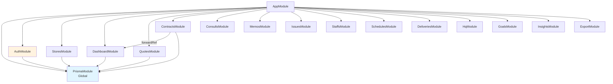


---

## 14. Authentication Architecture Detail (인증 구조 상세)

### 14.1 JWT 토큰 흐름

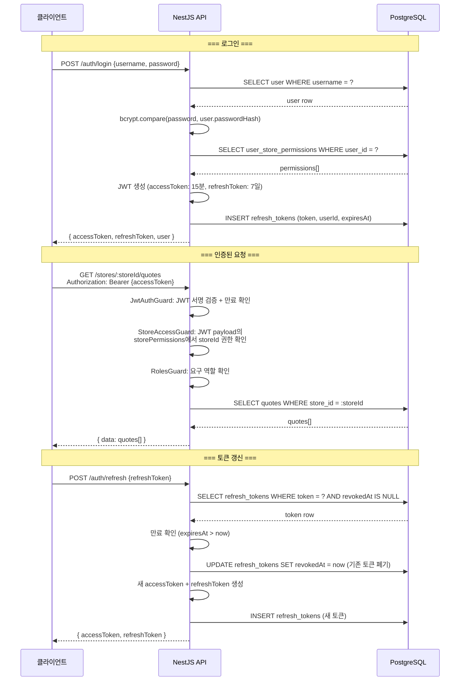

### 14.2 JWT Payload 구조

```typescript
// accessToken payload
interface JwtPayload {
  sub: string;           // user.id (UUID)
  username: string;
  role: Role;            // HQ_ADMIN | STORE_MANAGER | STORE_STAFF | READONLY
  storePermissions: {    // 접근 가능한 매장 목록 (JWT에 포함하여 DB 조회 최소화)
    storeId: string;
    level: PermissionLevel;
  }[];
  iat: number;           // 발급 시간
  exp: number;           // 만료 시간 (15분)
}
```

**설계 결정**: `storePermissions`를 JWT payload에 포함하는 이유
- 매 요청마다 DB에서 권한을 조회하지 않아도 됨 (성능)
- 권한 변경 시 최대 15분 후 반영 (accessToken 만료 주기)
- 매장 수가 많지 않은 시스템 특성상 payload 크기 문제 없음

### 14.3 JwtStrategy (Passport)

```typescript
// src/modules/auth/strategies/jwt.strategy.ts
import { Injectable, UnauthorizedException } from '@nestjs/common';
import { PassportStrategy } from '@nestjs/passport';
import { ExtractJwt, Strategy } from 'passport-jwt';
import { ConfigService } from '@nestjs/config';
import { JwtPayload } from '../interfaces/jwt-payload.interface';

@Injectable()
export class JwtStrategy extends PassportStrategy(Strategy) {
  constructor(private configService: ConfigService) {
    super({
      jwtFromRequest: ExtractJwt.fromAuthHeaderAsBearerToken(),
      ignoreExpiration: false,
      secretOrKey: configService.get<string>('JWT_SECRET'),
    });
  }

  /**
   * JWT 검증 후 호출. payload를 request.user에 주입한다.
   * @precondition JWT 서명이 유효하고 만료되지 않음
   * @postcondition request.user에 AuthenticatedUser 객체가 설정됨
   */
  async validate(payload: JwtPayload): Promise<AuthenticatedUser> {
    return {
      id: payload.sub,
      username: payload.username,
      role: payload.role,
      storePermissions: new Map(
        payload.storePermissions.map((p) => [p.storeId, p.level]),
      ),
    };
  }
}
```

### 14.4 LocalStrategy (로그인용)

```typescript
// src/modules/auth/strategies/local.strategy.ts
import { Injectable, UnauthorizedException } from '@nestjs/common';
import { PassportStrategy } from '@nestjs/passport';
import { Strategy } from 'passport-local';
import { AuthService } from '../auth.service';

@Injectable()
export class LocalStrategy extends PassportStrategy(Strategy) {
  constructor(private authService: AuthService) {
    super({ usernameField: 'username' });
  }

  async validate(username: string, password: string): Promise<any> {
    const user = await this.authService.validateUser(username, password);
    if (!user) {
      throw new UnauthorizedException('아이디 또는 비밀번호가 올바르지 않습니다.');
    }
    return user;
  }
}
```

### 14.5 Guards 상세

#### JwtAuthGuard (전역)

```typescript
// src/common/guards/jwt-auth.guard.ts
import { ExecutionContext, Injectable } from '@nestjs/common';
import { AuthGuard } from '@nestjs/passport';
import { Reflector } from '@nestjs/core';
import { IS_PUBLIC_KEY } from '../decorators/public.decorator';

@Injectable()
export class JwtAuthGuard extends AuthGuard('jwt') {
  constructor(private reflector: Reflector) {
    super();
  }

  canActivate(context: ExecutionContext) {
    // @Public() 데코레이터가 있으면 인증 건너뜀
    const isPublic = this.reflector.getAllAndOverride<boolean>(IS_PUBLIC_KEY, [
      context.getHandler(),
      context.getClass(),
    ]);
    if (isPublic) return true;
    return super.canActivate(context);
  }
}
```

#### RolesGuard

```typescript
// src/common/guards/roles.guard.ts
import { Injectable, CanActivate, ExecutionContext, ForbiddenException } from '@nestjs/common';
import { Reflector } from '@nestjs/core';
import { Role } from '../types/roles.enum';
import { ROLES_KEY } from '../decorators/roles.decorator';

const ROLE_HIERARCHY: Record<Role, number> = {
  [Role.HQ_ADMIN]: 4,
  [Role.STORE_MANAGER]: 3,
  [Role.STORE_STAFF]: 2,
  [Role.READONLY]: 1,
};

@Injectable()
export class RolesGuard implements CanActivate {
  constructor(private reflector: Reflector) {}

  canActivate(context: ExecutionContext): boolean {
    const requiredRoles = this.reflector.getAllAndOverride<Role[]>(ROLES_KEY, [
      context.getHandler(),
      context.getClass(),
    ]);
    if (!requiredRoles) return true;

    const { user } = context.switchToHttp().getRequest();
    // 최소 요구 역할의 hierarchy 값
    const minRequired = Math.min(...requiredRoles.map((r) => ROLE_HIERARCHY[r]));
    const userLevel = ROLE_HIERARCHY[user.role];

    if (userLevel < minRequired) {
      throw new ForbiddenException('권한이 부족합니다.');
    }
    return true;
  }
}
```

#### StoreAccessGuard

```typescript
// src/common/guards/store-access.guard.ts
import { Injectable, CanActivate, ExecutionContext, ForbiddenException } from '@nestjs/common';
import { Role } from '../types/roles.enum';
import { PermissionLevel } from '../types/roles.enum';

@Injectable()
export class StoreAccessGuard implements CanActivate {
  canActivate(context: ExecutionContext): boolean {
    const request = context.switchToHttp().getRequest();
    const user = request.user;
    const storeId = request.params.storeId;

    // storeId가 URL에 없으면 이 Guard는 적용되지 않음
    if (!storeId) return true;

    // HQ_ADMIN은 모든 매장 접근 가능
    if (user.role === Role.HQ_ADMIN) return true;

    // storePermissions에서 해당 매장 권한 확인
    const permission = user.storePermissions.get(storeId);
    if (!permission || permission === PermissionLevel.NONE) {
      throw new ForbiddenException('해당 매장에 대한 접근 권한이 없습니다.');
    }

    return true;
  }
}
```

### 14.6 커스텀 데코레이터

```typescript
// src/common/decorators/public.decorator.ts
import { SetMetadata } from '@nestjs/common';
export const IS_PUBLIC_KEY = 'isPublic';
export const Public = () => SetMetadata(IS_PUBLIC_KEY, true);

// src/common/decorators/roles.decorator.ts
import { SetMetadata } from '@nestjs/common';
import { Role } from '../types/roles.enum';
export const ROLES_KEY = 'roles';
export const Roles = (...roles: Role[]) => SetMetadata(ROLES_KEY, roles);

// src/common/decorators/current-user.decorator.ts
import { createParamDecorator, ExecutionContext } from '@nestjs/common';
export const CurrentUser = createParamDecorator(
  (data: string | undefined, ctx: ExecutionContext) => {
    const request = ctx.switchToHttp().getRequest();
    const user = request.user;
    return data ? user?.[data] : user;
  },
);
```

### 14.7 Guard 적용 순서

요청 처리 파이프라인에서 Guard는 다음 순서로 실행된다:

```
요청 → JwtAuthGuard (전역, JWT 검증)
     → RolesGuard (컨트롤러/핸들러 레벨, 역할 확인)
     → StoreAccessGuard (컨트롤러/핸들러 레벨, 매장 접근 확인)
     → Controller Handler
```

```mermaid
flowchart LR
    REQ[HTTP 요청] --> JWT{JwtAuthGuard<br/>@Public?}
    JWT -->|Public| HANDLER[Controller]
    JWT -->|인증 필요| VERIFY[JWT 검증]
    VERIFY -->|실패| R401[401 Unauthorized]
    VERIFY -->|성공| ROLES{RolesGuard<br/>@Roles?}
    ROLES -->|역할 부족| R403A[403 Forbidden]
    ROLES -->|통과| STORE{StoreAccessGuard<br/>storeId?}
    STORE -->|권한 없음| R403B[403 Forbidden]
    STORE -->|통과| HANDLER
```


---

## 15. Core API Implementation Design (핵심 API 구현 상세 설계)

5개 핵심 API에 대해 Controller → Service → DTO 구조를 구체적으로 설계한다.
모든 데이터는 `store_id` 기준으로 분리되며, KPI 계산은 반드시 `DashboardService`에서 수행한다.

---

### 15.1 POST /auth/login (로그인)

#### 시퀀스 다이어그램

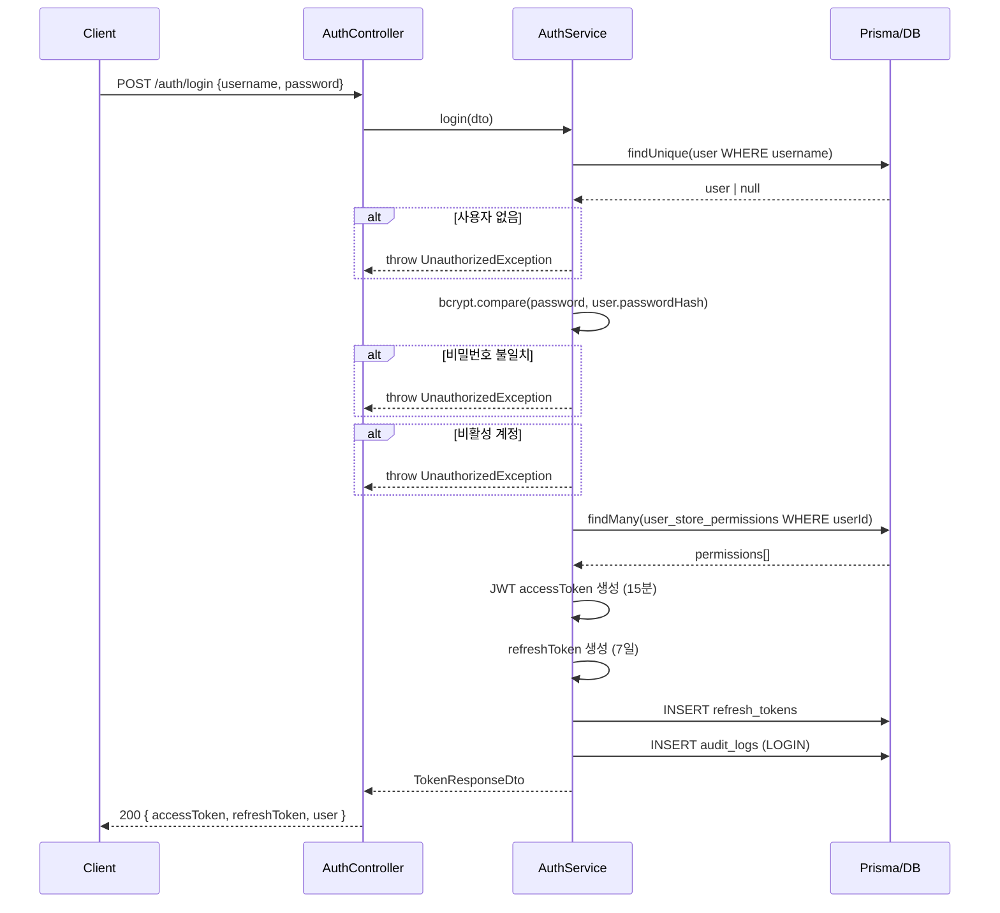

#### DTO

```typescript
// src/modules/auth/dto/login.dto.ts
import { IsString, IsNotEmpty, MinLength } from 'class-validator';

export class LoginDto {
  @IsString()
  @IsNotEmpty()
  username: string;

  @IsString()
  @IsNotEmpty()
  @MinLength(4)
  password: string;
}
```

```typescript
// src/modules/auth/dto/token-response.dto.ts
export class TokenResponseDto {
  accessToken: string;
  refreshToken: string;
  user: {
    id: string;
    username: string;
    name: string;
    role: string;
    storePermissions: {
      storeId: string;
      storeName: string;
      level: string;
    }[];
  };
}
```

#### Controller

```typescript
// src/modules/auth/auth.controller.ts
import { Controller, Post, Body, HttpCode, HttpStatus } from '@nestjs/common';
import { AuthService } from './auth.service';
import { LoginDto } from './dto/login.dto';
import { TokenResponseDto } from './dto/token-response.dto';
import { Public } from '../../common/decorators/public.decorator';

@Controller('auth')
export class AuthController {
  constructor(private readonly authService: AuthService) {}

  @Public()
  @Post('login')
  @HttpCode(HttpStatus.OK)
  async login(@Body() dto: LoginDto): Promise<TokenResponseDto> {
    return this.authService.login(dto);
  }

  @Post('refresh')
  @Public()
  @HttpCode(HttpStatus.OK)
  async refresh(@Body('refreshToken') refreshToken: string): Promise<TokenResponseDto> {
    return this.authService.refresh(refreshToken);
  }

  @Post('logout')
  @HttpCode(HttpStatus.NO_CONTENT)
  async logout(@Body('refreshToken') refreshToken: string): Promise<void> {
    return this.authService.logout(refreshToken);
  }
}
```

#### Service

```typescript
// src/modules/auth/auth.service.ts
import { Injectable, UnauthorizedException } from '@nestjs/common';
import { JwtService } from '@nestjs/jwt';
import { ConfigService } from '@nestjs/config';
import * as bcrypt from 'bcrypt';
import { v4 as uuidv4 } from 'uuid';
import { PrismaService } from '../../prisma/prisma.service';
import { LoginDto } from './dto/login.dto';
import { TokenResponseDto } from './dto/token-response.dto';
import { JwtPayload } from './interfaces/jwt-payload.interface';

@Injectable()
export class AuthService {
  constructor(
    private prisma: PrismaService,
    private jwtService: JwtService,
    private configService: ConfigService,
  ) {}

  /**
   * @precondition dto.username, dto.password는 비어있지 않은 문자열
   * @postcondition 성공: 유효한 accessToken(15분) + refreshToken(7일) 반환
   * @postcondition 실패: UnauthorizedException
   * @postcondition audit_logs에 로그인 시도 기록
   */
  async login(dto: LoginDto): Promise<TokenResponseDto> {
    // 1. 사용자 조회
    const user = await this.prisma.user.findUnique({
      where: { username: dto.username },
    });

    if (!user) {
      throw new UnauthorizedException('아이디 또는 비밀번호가 올바르지 않습니다.');
    }

    // 2. 비밀번호 검증
    const isPasswordValid = await bcrypt.compare(dto.password, user.passwordHash);
    if (!isPasswordValid) {
      throw new UnauthorizedException('아이디 또는 비밀번호가 올바르지 않습니다.');
    }

    // 3. 활성 상태 확인
    if (!user.isActive) {
      throw new UnauthorizedException('비활성화된 계정입니다.');
    }

    // 4. 매장 권한 조회
    const permissions = await this.prisma.userStorePermission.findMany({
      where: { userId: user.id },
      include: { store: { select: { id: true, name: true } } },
    });

    // 5. JWT 토큰 생성
    const payload: JwtPayload = {
      sub: user.id,
      username: user.username,
      role: user.role,
      storePermissions: permissions.map((p) => ({
        storeId: p.storeId,
        level: p.permissionLevel,
      })),
    };

    const accessToken = this.jwtService.sign(payload);
    const refreshToken = uuidv4();
    const refreshExpiresAt = new Date(Date.now() + 7 * 24 * 60 * 60 * 1000);

    // 6. refreshToken DB 저장
    await this.prisma.refreshToken.create({
      data: {
        userId: user.id,
        token: refreshToken,
        expiresAt: refreshExpiresAt,
      },
    });

    return {
      accessToken,
      refreshToken,
      user: {
        id: user.id,
        username: user.username,
        name: user.name,
        role: user.role,
        storePermissions: permissions.map((p) => ({
          storeId: p.store.id,
          storeName: p.store.name,
          level: p.permissionLevel,
        })),
      },
    };
  }

  /**
   * Refresh Token Rotation: 기존 토큰 폐기 후 새 토큰 쌍 발급
   * @precondition refreshToken이 DB에 존재하고 폐기되지 않았으며 만료되지 않음
   * @postcondition 기존 refreshToken은 revokedAt이 설정됨
   * @postcondition 새 accessToken + refreshToken 반환
   */
  async refresh(refreshToken: string): Promise<TokenResponseDto> {
    const stored = await this.prisma.refreshToken.findUnique({
      where: { token: refreshToken },
      include: { user: true },
    });

    if (!stored || stored.revokedAt || stored.expiresAt < new Date()) {
      throw new UnauthorizedException('유효하지 않은 리프레시 토큰입니다.');
    }

    // 기존 토큰 폐기
    await this.prisma.refreshToken.update({
      where: { id: stored.id },
      data: { revokedAt: new Date() },
    });

    // 새 토큰 발급 (login과 동일한 로직)
    const permissions = await this.prisma.userStorePermission.findMany({
      where: { userId: stored.userId },
      include: { store: { select: { id: true, name: true } } },
    });

    const payload: JwtPayload = {
      sub: stored.user.id,
      username: stored.user.username,
      role: stored.user.role,
      storePermissions: permissions.map((p) => ({
        storeId: p.storeId,
        level: p.permissionLevel,
      })),
    };

    const newAccessToken = this.jwtService.sign(payload);
    const newRefreshToken = uuidv4();

    await this.prisma.refreshToken.create({
      data: {
        userId: stored.userId,
        token: newRefreshToken,
        expiresAt: new Date(Date.now() + 7 * 24 * 60 * 60 * 1000),
      },
    });

    return {
      accessToken: newAccessToken,
      refreshToken: newRefreshToken,
      user: {
        id: stored.user.id,
        username: stored.user.username,
        name: stored.user.name,
        role: stored.user.role,
        storePermissions: permissions.map((p) => ({
          storeId: p.store.id,
          storeName: p.store.name,
          level: p.permissionLevel,
        })),
      },
    };
  }

  async logout(refreshToken: string): Promise<void> {
    await this.prisma.refreshToken.updateMany({
      where: { token: refreshToken, revokedAt: null },
      data: { revokedAt: new Date() },
    });
  }
}
```


---

### 15.2 GET /stores (매장 목록)

#### 시퀀스 다이어그램

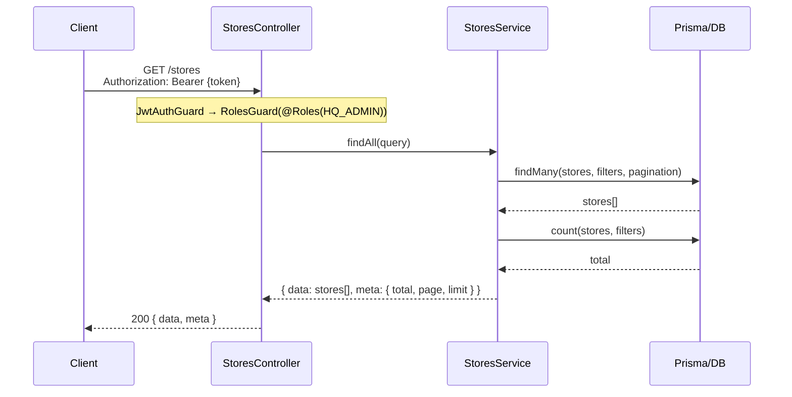

#### DTO

```typescript
// src/modules/stores/dto/store-list-query.dto.ts
import { IsOptional, IsString, IsBoolean, IsInt, Min } from 'class-validator';
import { Transform, Type } from 'class-transformer';

export class StoreListQueryDto {
  @IsOptional()
  @IsString()
  search?: string;  // name 또는 code로 검색

  @IsOptional()
  @IsString()
  region?: string;

  @IsOptional()
  @Transform(({ value }) => value === 'true')
  @IsBoolean()
  isActive?: boolean;

  @IsOptional()
  @Type(() => Number)
  @IsInt()
  @Min(1)
  page?: number = 1;

  @IsOptional()
  @Type(() => Number)
  @IsInt()
  @Min(1)
  limit?: number = 20;
}
```

```typescript
// src/modules/stores/dto/store-response.dto.ts
export class StoreResponseDto {
  id: string;
  name: string;
  code: string;
  address: string | null;
  phone: string | null;
  region: string | null;
  isActive: boolean;
  createdAt: Date;
}

export class StoreListResponseDto {
  data: StoreResponseDto[];
  meta: {
    total: number;
    page: number;
    limit: number;
    totalPages: number;
  };
}
```


#### Controller

```typescript
// src/modules/stores/stores.controller.ts
import { Controller, Get, Query, UseGuards } from '@nestjs/common';
import { StoresService } from './stores.service';
import { StoreListQueryDto } from './dto/store-list-query.dto';
import { StoreListResponseDto } from './dto/store-response.dto';
import { Roles } from '../../common/decorators/roles.decorator';
import { RolesGuard } from '../../common/guards/roles.guard';
import { Role } from '../../common/types/roles.enum';

@Controller('stores')
@UseGuards(RolesGuard)
export class StoresController {
  constructor(private readonly storesService: StoresService) {}

  @Get()
  @Roles(Role.HQ_ADMIN)
  async findAll(@Query() query: StoreListQueryDto): Promise<StoreListResponseDto> {
    return this.storesService.findAll(query);
  }
}
```

#### Service

```typescript
// src/modules/stores/stores.service.ts
import { Injectable } from '@nestjs/common';
import { PrismaService } from '../../prisma/prisma.service';
import { StoreListQueryDto } from './dto/store-list-query.dto';
import { StoreListResponseDto } from './dto/store-response.dto';
import { Prisma } from '@prisma/client';

@Injectable()
export class StoresService {
  constructor(private prisma: PrismaService) {}

  /**
   * @precondition 호출자는 HQ_ADMIN 역할
   * @postcondition 반환된 매장 목록은 필터 조건에 부합
   * @postcondition pagination meta 정보가 정확함
   */
  async findAll(query: StoreListQueryDto): Promise<StoreListResponseDto> {
    const { search, region, isActive, page = 1, limit = 20 } = query;

    const where: Prisma.StoreWhereInput = {
      ...(search && {
        OR: [
          { name: { contains: search, mode: 'insensitive' } },
          { code: { contains: search, mode: 'insensitive' } },
        ],
      }),
      ...(region && { region }),
      ...(isActive !== undefined && { isActive }),
    };

    const [stores, total] = await Promise.all([
      this.prisma.store.findMany({
        where,
        skip: (page - 1) * limit,
        take: limit,
        orderBy: { name: 'asc' },
        select: {
          id: true,
          name: true,
          code: true,
          address: true,
          phone: true,
          region: true,
          isActive: true,
          createdAt: true,
        },
      }),
      this.prisma.store.count({ where }),
    ]);

    return {
      data: stores,
      meta: {
        total,
        page,
        limit,
        totalPages: Math.ceil(total / limit),
      },
    };
  }
}
```


---

### 15.3 GET /stores/:storeId/metrics/:year/:month (대시보드 월간 지표)

#### 시퀀스 다이어그램

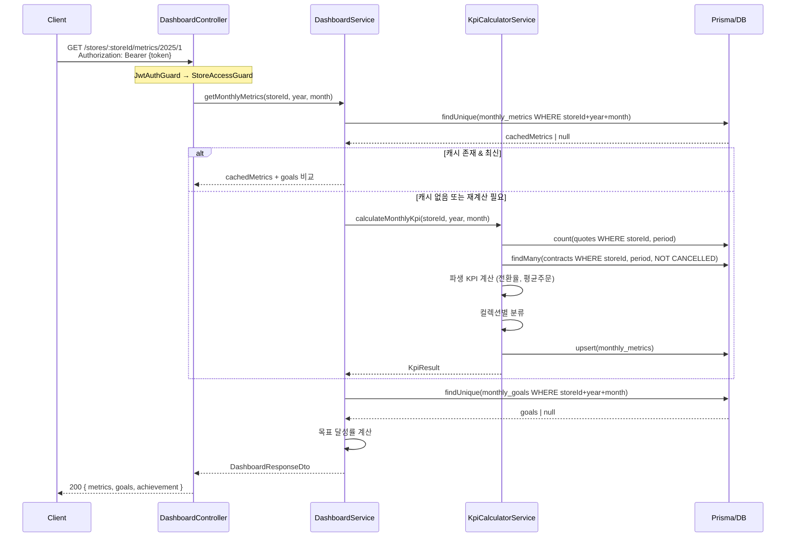

#### DTO

```typescript
// src/modules/dashboard/dto/dashboard-params.dto.ts
import { IsUUID, IsInt, Min, Max } from 'class-validator';
import { Type } from 'class-transformer';

export class DashboardParamsDto {
  @IsUUID()
  storeId: string;

  @Type(() => Number)
  @IsInt()
  @Min(2020)
  year: number;

  @Type(() => Number)
  @IsInt()
  @Min(1)
  @Max(12)
  month: number;
}
```

```typescript
// src/modules/dashboard/dto/dashboard-response.dto.ts
export class DashboardResponseDto {
  metrics: {
    quoteCount: number;
    contractCount: number;
    contractAmount: number;
    conversionRate: number;
    avgOrderValue: number;
    collectionBreakdown: Record<string, {
      contractCount: number;
      totalAmount: number;
      itemCount: number;
    }>;
    calculatedAt: Date;
  };
  goals: {
    targetAmount: number;
    targetContracts: number;
    targetConsults: number;
  } | null;
  achievement: {
    amountRate: number;      // (contractAmount / targetAmount) * 100
    contractRate: number;    // (contractCount / targetContracts) * 100
    consultRate: number;     // (consultCount / targetConsults) * 100
  } | null;
}
```


#### Controller

```typescript
// src/modules/dashboard/dashboard.controller.ts
import { Controller, Get, Param, Post, UseGuards } from '@nestjs/common';
import { DashboardService } from './dashboard.service';
import { DashboardParamsDto } from './dto/dashboard-params.dto';
import { DashboardResponseDto } from './dto/dashboard-response.dto';
import { StoreAccessGuard } from '../../common/guards/store-access.guard';
import { RolesGuard } from '../../common/guards/roles.guard';
import { Roles } from '../../common/decorators/roles.decorator';
import { Role } from '../../common/types/roles.enum';

@Controller('stores/:storeId')
@UseGuards(StoreAccessGuard, RolesGuard)
export class DashboardController {
  constructor(private readonly dashboardService: DashboardService) {}

  @Get('metrics/:year/:month')
  @Roles(Role.READONLY)
  async getMonthlyMetrics(
    @Param() params: DashboardParamsDto,
  ): Promise<DashboardResponseDto> {
    return this.dashboardService.getMonthlyMetrics(
      params.storeId,
      params.year,
      params.month,
    );
  }

  @Post('metrics/recalculate')
  @Roles(Role.STORE_MANAGER)
  async recalculate(
    @Param('storeId') storeId: string,
  ): Promise<DashboardResponseDto> {
    const now = new Date();
    return this.dashboardService.recalculate(
      storeId,
      now.getFullYear(),
      now.getMonth() + 1,
    );
  }
}
```

#### Service (KPI 계산은 반드시 DashboardService에서 수행)

```typescript
// src/modules/dashboard/dashboard.service.ts
import { Injectable } from '@nestjs/common';
import { PrismaService } from '../../prisma/prisma.service';
import { KpiCalculatorService } from './kpi-calculator.service';
import { DashboardResponseDto } from './dto/dashboard-response.dto';

@Injectable()
export class DashboardService {
  constructor(
    private prisma: PrismaService,
    private kpiCalculator: KpiCalculatorService,
  ) {}

  /**
   * 월간 대시보드 지표를 조회한다.
   * 캐시된 데이터가 있으면 반환, 없으면 KpiCalculatorService로 계산 후 반환.
   *
   * @precondition storeId는 유효한 UUID, stores 테이블에 존재
   * @precondition year >= 2020, 1 <= month <= 12
   * @postcondition metrics.contractCount는 취소된 계약 제외
   * @postcondition achievement는 goals가 존재할 때만 계산
   */
  async getMonthlyMetrics(
    storeId: string,
    year: number,
    month: number,
  ): Promise<DashboardResponseDto> {
    // 1. 캐시된 지표 조회
    let metrics = await this.prisma.monthlyMetric.findUnique({
      where: { storeId_year_month: { storeId, year, month } },
    });

    // 2. 캐시 없으면 계산
    if (!metrics) {
      const kpiResult = await this.kpiCalculator.calculateMonthlyKpi(storeId, year, month);
      metrics = await this.prisma.monthlyMetric.findUnique({
        where: { storeId_year_month: { storeId, year, month } },
      });
    }

    // 3. 목표 조회
    const goals = await this.prisma.monthlyGoal.findUnique({
      where: { storeId_year_month: { storeId, year, month } },
    });

    // 4. 달성률 계산
    const achievement = goals
      ? {
          amountRate: goals.targetAmount.toNumber() > 0
            ? (metrics.contractAmount.toNumber() / goals.targetAmount.toNumber()) * 100
            : 0,
          contractRate: goals.targetContracts > 0
            ? (metrics.contractCount / goals.targetContracts) * 100
            : 0,
          consultRate: goals.targetConsults > 0
            ? (metrics.consultCount / goals.targetConsults) * 100
            : 0,
        }
      : null;

    return {
      metrics: {
        quoteCount: metrics.quoteCount,
        contractCount: metrics.contractCount,
        contractAmount: metrics.contractAmount.toNumber(),
        conversionRate: metrics.conversionRate.toNumber(),
        avgOrderValue: metrics.avgOrderValue.toNumber(),
        collectionBreakdown: metrics.collectionBreakdown as any,
        calculatedAt: metrics.calculatedAt,
      },
      goals: goals
        ? {
            targetAmount: goals.targetAmount.toNumber(),
            targetContracts: goals.targetContracts,
            targetConsults: goals.targetConsults,
          }
        : null,
      achievement,
    };
  }

  async recalculate(
    storeId: string,
    year: number,
    month: number,
  ): Promise<DashboardResponseDto> {
    await this.kpiCalculator.calculateMonthlyKpi(storeId, year, month);
    return this.getMonthlyMetrics(storeId, year, month);
  }
}
```


#### KpiCalculatorService (핵심 KPI 계산 엔진)

```typescript
// src/modules/dashboard/kpi-calculator.service.ts
import { Injectable } from '@nestjs/common';
import { PrismaService } from '../../prisma/prisma.service';
import { Collection } from '@prisma/client';

interface KpiResult {
  quoteCount: number;
  contractCount: number;
  contractAmount: number;
  conversionRate: number;
  avgOrderValue: number;
  collectionBreakdown: Record<string, { contractCount: number; totalAmount: number; itemCount: number }>;
}

@Injectable()
export class KpiCalculatorService {
  constructor(private prisma: PrismaService) {}

  /**
   * 특정 매장의 월간 KPI를 계산하고 monthly_metrics에 저장한다.
   *
   * @precondition storeId는 stores 테이블에 존재하는 유효한 UUID
   * @precondition year >= 2020, 1 <= month <= 12
   * @postcondition contractCount는 status !== 'CANCELLED'인 계약만 포함
   * @postcondition conversionRate = contractCount / quoteCount (quoteCount > 0)
   * @postcondition avgOrderValue = contractAmount / contractCount (contractCount > 0)
   * @postcondition SUM(collectionBreakdown[*].totalAmount) === contractAmount
   */
  async calculateMonthlyKpi(storeId: string, year: number, month: number): Promise<KpiResult> {
    const startDate = new Date(year, month - 1, 1);
    const endDate = new Date(year, month, 0, 23, 59, 59, 999);

    // 1. 견적 수
    const quoteCount = await this.prisma.quote.count({
      where: {
        storeId,
        createdAt: { gte: startDate, lte: endDate },
      },
    });

    // 2. 계약 (취소 제외) + items
    const contracts = await this.prisma.contract.findMany({
      where: {
        storeId,
        contractDate: { gte: startDate, lte: endDate },
        status: { not: 'CANCELLED' },
      },
      include: { items: true },
    });

    const contractCount = contracts.length;
    const contractAmount = contracts.reduce(
      (sum, c) => sum + c.totalAmount.toNumber(), 0,
    );

    // 3. 파생 KPI
    const conversionRate = quoteCount > 0 ? contractCount / quoteCount : 0;
    const avgOrderValue = contractCount > 0 ? contractAmount / contractCount : 0;

    // 4. 컬렉션별 분류
    const collectionBreakdown = this.buildCollectionBreakdown(contracts);

    // 5. monthly_metrics upsert
    await this.prisma.monthlyMetric.upsert({
      where: { storeId_year_month: { storeId, year, month } },
      update: {
        quoteCount,
        contractCount,
        contractAmount,
        conversionRate,
        avgOrderValue,
        collectionBreakdown,
        calculatedAt: new Date(),
      },
      create: {
        storeId,
        year,
        month,
        quoteCount,
        contractCount,
        contractAmount,
        conversionRate,
        avgOrderValue,
        collectionBreakdown,
        calculatedAt: new Date(),
      },
    });

    return { quoteCount, contractCount, contractAmount, conversionRate, avgOrderValue, collectionBreakdown };
  }

  private buildCollectionBreakdown(
    contracts: Array<{ items: Array<{ collection: Collection; totalPrice: any; quantity: number }> }>,
  ) {
    const breakdown: Record<string, { contractCount: number; totalAmount: number; itemCount: number }> = {};
    for (const col of Object.values(Collection)) {
      breakdown[col] = { contractCount: 0, totalAmount: 0, itemCount: 0 };
    }

    for (const contract of contracts) {
      const seen = new Set<string>();
      for (const item of contract.items) {
        breakdown[item.collection].totalAmount += Number(item.totalPrice);
        breakdown[item.collection].itemCount += item.quantity;
        seen.add(item.collection);
      }
      for (const col of seen) {
        breakdown[col].contractCount += 1;
      }
    }

    return breakdown;
  }
}
```


---

### 15.4 POST /stores/:storeId/quotes (견적 생성)

#### 시퀀스 다이어그램

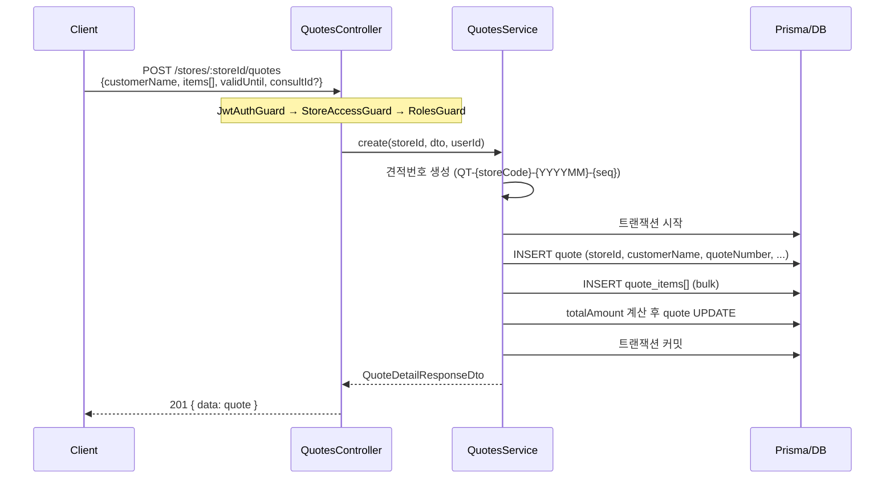

#### DTO

```typescript
// src/modules/quotes/dto/create-quote.dto.ts
import {
  IsString, IsNotEmpty, IsOptional, IsUUID, IsArray,
  ValidateNested, IsEnum, IsInt, Min, IsNumber, IsDateString,
} from 'class-validator';
import { Type } from 'class-transformer';
import { Collection } from '@prisma/client';

export class CreateQuoteItemDto {
  @IsString()
  @IsNotEmpty()
  productName: string;

  @IsEnum(Collection)
  collection: Collection;

  @IsInt()
  @Min(1)
  quantity: number;

  @IsNumber()
  @Min(0)
  unitPrice: number;

  @IsOptional()
  @IsString()
  notes?: string;
}

export class CreateQuoteDto {
  @IsString()
  @IsNotEmpty()
  customerName: string;

  @IsOptional()
  @IsUUID()
  consultId?: string;

  @IsArray()
  @ValidateNested({ each: true })
  @Type(() => CreateQuoteItemDto)
  items: CreateQuoteItemDto[];

  @IsOptional()
  @IsDateString()
  validUntil?: string;
}
```

```typescript
// src/modules/quotes/dto/quote-response.dto.ts
export class QuoteDetailResponseDto {
  id: string;
  storeId: string;
  quoteNumber: string;
  customerName: string;
  totalAmount: number;
  status: string;
  validUntil: string | null;
  consultId: string | null;
  items: {
    id: string;
    productName: string;
    collection: string;
    quantity: number;
    unitPrice: number;
    totalPrice: number;
    notes: string | null;
  }[];
  createdBy: string | null;
  createdAt: Date;
}
```


#### Controller

```typescript
// src/modules/quotes/quotes.controller.ts
import { Controller, Post, Body, Param, UseGuards } from '@nestjs/common';
import { QuotesService } from './quotes.service';
import { CreateQuoteDto } from './dto/create-quote.dto';
import { QuoteDetailResponseDto } from './dto/quote-response.dto';
import { StoreAccessGuard } from '../../common/guards/store-access.guard';
import { RolesGuard } from '../../common/guards/roles.guard';
import { Roles } from '../../common/decorators/roles.decorator';
import { CurrentUser } from '../../common/decorators/current-user.decorator';
import { Role } from '../../common/types/roles.enum';

@Controller('stores/:storeId/quotes')
@UseGuards(StoreAccessGuard, RolesGuard)
export class QuotesController {
  constructor(private readonly quotesService: QuotesService) {}

  @Post()
  @Roles(Role.STORE_STAFF)
  async create(
    @Param('storeId') storeId: string,
    @Body() dto: CreateQuoteDto,
    @CurrentUser('id') userId: string,
  ): Promise<QuoteDetailResponseDto> {
    return this.quotesService.create(storeId, dto, userId);
  }
}
```

#### Service

```typescript
// src/modules/quotes/quotes.service.ts
import { Injectable, NotFoundException } from '@nestjs/common';
import { PrismaService } from '../../prisma/prisma.service';
import { CreateQuoteDto } from './dto/create-quote.dto';
import { QuoteDetailResponseDto } from './dto/quote-response.dto';

@Injectable()
export class QuotesService {
  constructor(private prisma: PrismaService) {}

  /**
   * 견적을 생성한다. 트랜잭션으로 quote + quote_items를 원자적으로 생성.
   *
   * @precondition storeId는 stores 테이블에 존재
   * @precondition dto.items는 1개 이상
   * @precondition dto.consultId가 있으면 해당 consult는 같은 storeId에 속해야 함
   * @postcondition quote.totalAmount === SUM(items[].unitPrice * items[].quantity)
   * @postcondition quoteNumber는 유니크 (QT-{storeCode}-{YYYYMM}-{seq})
   */
  async create(
    storeId: string,
    dto: CreateQuoteDto,
    userId: string,
  ): Promise<QuoteDetailResponseDto> {
    // 1. 매장 코드 조회 (견적번호 생성용)
    const store = await this.prisma.store.findUniqueOrThrow({
      where: { id: storeId },
      select: { code: true },
    });

    // 2. consultId 유효성 검증
    if (dto.consultId) {
      const consult = await this.prisma.consult.findFirst({
        where: { id: dto.consultId, storeId },
      });
      if (!consult) {
        throw new NotFoundException('해당 상담 기록을 찾을 수 없습니다.');
      }
    }

    // 3. 견적번호 생성
    const quoteNumber = await this.generateQuoteNumber(store.code);

    // 4. totalAmount 계산
    const totalAmount = dto.items.reduce(
      (sum, item) => sum + item.unitPrice * item.quantity, 0,
    );

    // 5. 트랜잭션으로 생성
    const quote = await this.prisma.$transaction(async (tx) => {
      const created = await tx.quote.create({
        data: {
          storeId,
          consultId: dto.consultId || null,
          quoteNumber,
          customerName: dto.customerName,
          totalAmount,
          status: 'DRAFT',
          validUntil: dto.validUntil ? new Date(dto.validUntil) : null,
          createdBy: userId,
          items: {
            create: dto.items.map((item) => ({
              productName: item.productName,
              collection: item.collection,
              quantity: item.quantity,
              unitPrice: item.unitPrice,
              totalPrice: item.unitPrice * item.quantity,
              notes: item.notes || null,
            })),
          },
        },
        include: { items: true },
      });
      return created;
    });

    return this.toDetailResponse(quote);
  }

  private async generateQuoteNumber(storeCode: string): Promise<string> {
    const now = new Date();
    const prefix = `QT-${storeCode}-${now.getFullYear()}${String(now.getMonth() + 1).padStart(2, '0')}`;
    const lastQuote = await this.prisma.quote.findFirst({
      where: { quoteNumber: { startsWith: prefix } },
      orderBy: { quoteNumber: 'desc' },
    });
    const seq = lastQuote
      ? parseInt(lastQuote.quoteNumber.split('-').pop(), 10) + 1
      : 1;
    return `${prefix}-${String(seq).padStart(4, '0')}`;
  }

  private toDetailResponse(quote: any): QuoteDetailResponseDto {
    return {
      id: quote.id,
      storeId: quote.storeId,
      quoteNumber: quote.quoteNumber,
      customerName: quote.customerName,
      totalAmount: Number(quote.totalAmount),
      status: quote.status,
      validUntil: quote.validUntil?.toISOString().split('T')[0] || null,
      consultId: quote.consultId,
      items: quote.items.map((item: any) => ({
        id: item.id,
        productName: item.productName,
        collection: item.collection,
        quantity: item.quantity,
        unitPrice: Number(item.unitPrice),
        totalPrice: Number(item.totalPrice),
        notes: item.notes,
      })),
      createdBy: quote.createdBy,
      createdAt: quote.createdAt,
    };
  }
}
```


---

### 15.5 POST /stores/:storeId/contracts (계약 생성) + 취소 로직

#### 시퀀스 다이어그램 - 계약 생성

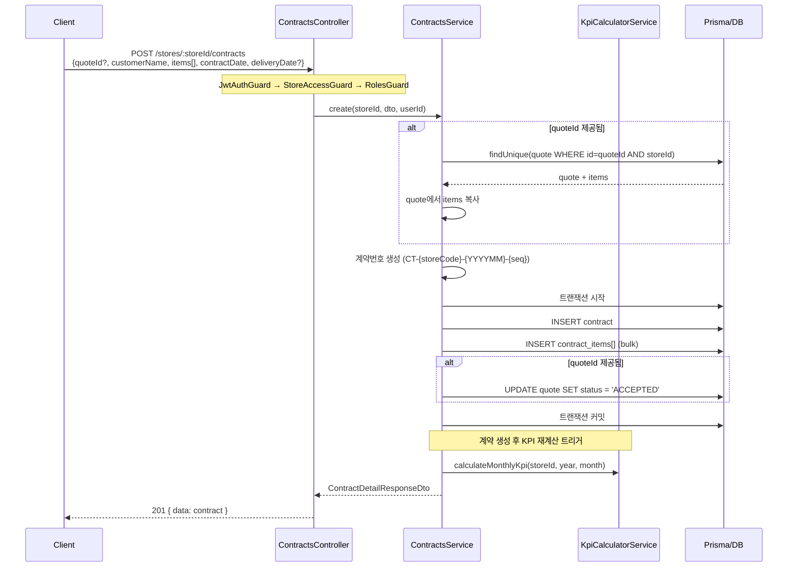

#### 시퀀스 다이어그램 - 계약 취소

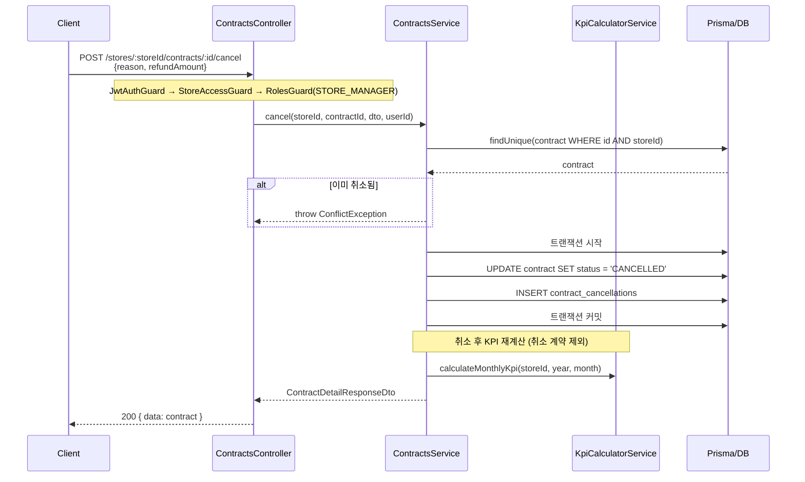

#### DTO

```typescript
// src/modules/contracts/dto/create-contract.dto.ts
import {
  IsString, IsNotEmpty, IsOptional, IsUUID, IsArray,
  ValidateNested, IsEnum, IsInt, Min, IsNumber, IsDateString,
} from 'class-validator';
import { Type } from 'class-transformer';
import { Collection } from '@prisma/client';

export class CreateContractItemDto {
  @IsString()
  @IsNotEmpty()
  productName: string;

  @IsEnum(Collection)
  collection: Collection;

  @IsInt()
  @Min(1)
  quantity: number;

  @IsNumber()
  @Min(0)
  unitPrice: number;
}

export class CreateContractDto {
  @IsOptional()
  @IsUUID()
  quoteId?: string;

  @IsString()
  @IsNotEmpty()
  customerName: string;

  @IsDateString()
  contractDate: string;

  @IsOptional()
  @IsDateString()
  deliveryDate?: string;

  /** quoteId가 없을 때 직접 items 입력 */
  @IsOptional()
  @IsArray()
  @ValidateNested({ each: true })
  @Type(() => CreateContractItemDto)
  items?: CreateContractItemDto[];
}
```

```typescript
// src/modules/contracts/dto/cancel-contract.dto.ts
import { IsString, IsNotEmpty, IsNumber, Min, IsOptional } from 'class-validator';

export class CancelContractDto {
  @IsString()
  @IsNotEmpty()
  reason: string;

  @IsOptional()
  @IsNumber()
  @Min(0)
  refundAmount?: number;
}
```


```typescript
// src/modules/contracts/dto/contract-response.dto.ts
export class ContractDetailResponseDto {
  id: string;
  storeId: string;
  contractNumber: string;
  customerName: string;
  totalAmount: number;
  status: string;
  contractDate: string;
  deliveryDate: string | null;
  quoteId: string | null;
  items: {
    id: string;
    productName: string;
    collection: string;
    quantity: number;
    unitPrice: number;
    totalPrice: number;
  }[];
  cancellation: {
    reason: string;
    refundAmount: number;
    cancelledDate: string;
    cancelledBy: string | null;
  } | null;
  createdBy: string | null;
  createdAt: Date;
}
```

#### Controller

```typescript
// src/modules/contracts/contracts.controller.ts
import { Controller, Post, Body, Param, UseGuards } from '@nestjs/common';
import { ContractsService } from './contracts.service';
import { CreateContractDto } from './dto/create-contract.dto';
import { CancelContractDto } from './dto/cancel-contract.dto';
import { ContractDetailResponseDto } from './dto/contract-response.dto';
import { StoreAccessGuard } from '../../common/guards/store-access.guard';
import { RolesGuard } from '../../common/guards/roles.guard';
import { Roles } from '../../common/decorators/roles.decorator';
import { CurrentUser } from '../../common/decorators/current-user.decorator';
import { Role } from '../../common/types/roles.enum';

@Controller('stores/:storeId/contracts')
@UseGuards(StoreAccessGuard, RolesGuard)
export class ContractsController {
  constructor(private readonly contractsService: ContractsService) {}

  @Post()
  @Roles(Role.STORE_STAFF)
  async create(
    @Param('storeId') storeId: string,
    @Body() dto: CreateContractDto,
    @CurrentUser('id') userId: string,
  ): Promise<ContractDetailResponseDto> {
    return this.contractsService.create(storeId, dto, userId);
  }

  @Post(':id/cancel')
  @Roles(Role.STORE_MANAGER)
  async cancel(
    @Param('storeId') storeId: string,
    @Param('id') contractId: string,
    @Body() dto: CancelContractDto,
    @CurrentUser('id') userId: string,
  ): Promise<ContractDetailResponseDto> {
    return this.contractsService.cancel(storeId, contractId, dto, userId);
  }
}
```


#### Service (계약 생성 + 취소 로직)

```typescript
// src/modules/contracts/contracts.service.ts
import {
  Injectable, NotFoundException, ConflictException, BadRequestException,
} from '@nestjs/common';
import { PrismaService } from '../../prisma/prisma.service';
import { KpiCalculatorService } from '../dashboard/kpi-calculator.service';
import { CreateContractDto } from './dto/create-contract.dto';
import { CancelContractDto } from './dto/cancel-contract.dto';
import { ContractDetailResponseDto } from './dto/contract-response.dto';

@Injectable()
export class ContractsService {
  constructor(
    private prisma: PrismaService,
    private kpiCalculator: KpiCalculatorService,
  ) {}

  /**
   * 계약을 생성한다.
   * quoteId가 있으면 견적의 items를 복사하고 견적 상태를 ACCEPTED로 변경.
   * 생성 후 해당 월의 KPI를 재계산한다.
   *
   * @precondition storeId는 stores 테이블에 존재
   * @precondition quoteId가 있으면 해당 quote는 같은 storeId에 속하고 status가 DRAFT 또는 SENT
   * @precondition quoteId가 없으면 dto.items는 1개 이상 필수
   * @postcondition contract.totalAmount === SUM(items[].unitPrice * items[].quantity)
   * @postcondition quoteId 제공 시 quote.status === 'ACCEPTED'
   * @postcondition 해당 월 monthly_metrics가 재계산됨
   */
  async create(
    storeId: string,
    dto: CreateContractDto,
    userId: string,
  ): Promise<ContractDetailResponseDto> {
    const store = await this.prisma.store.findUniqueOrThrow({
      where: { id: storeId },
      select: { code: true },
    });

    let items: Array<{ productName: string; collection: any; quantity: number; unitPrice: number }>;

    // 견적 기반 계약 vs 직접 입력
    if (dto.quoteId) {
      const quote = await this.prisma.quote.findFirst({
        where: { id: dto.quoteId, storeId },
        include: { items: true },
      });
      if (!quote) {
        throw new NotFoundException('해당 견적을 찾을 수 없습니다.');
      }
      if (quote.status === 'ACCEPTED' || quote.status === 'REJECTED' || quote.status === 'EXPIRED') {
        throw new ConflictException(`이미 ${quote.status} 상태인 견적입니다.`);
      }
      items = quote.items.map((qi) => ({
        productName: qi.productName,
        collection: qi.collection,
        quantity: qi.quantity,
        unitPrice: Number(qi.unitPrice),
      }));
    } else {
      if (!dto.items || dto.items.length === 0) {
        throw new BadRequestException('견적 ID가 없으면 items를 직접 입력해야 합니다.');
      }
      items = dto.items;
    }

    const contractNumber = await this.generateContractNumber(store.code);
    const totalAmount = items.reduce((sum, i) => sum + i.unitPrice * i.quantity, 0);
    const contractDate = new Date(dto.contractDate);

    const contract = await this.prisma.$transaction(async (tx) => {
      const created = await tx.contract.create({
        data: {
          storeId,
          quoteId: dto.quoteId || null,
          contractNumber,
          customerName: dto.customerName,
          totalAmount,
          status: 'ACTIVE',
          contractDate,
          deliveryDate: dto.deliveryDate ? new Date(dto.deliveryDate) : null,
          createdBy: userId,
          items: {
            create: items.map((item) => ({
              productName: item.productName,
              collection: item.collection,
              quantity: item.quantity,
              unitPrice: item.unitPrice,
              totalPrice: item.unitPrice * item.quantity,
            })),
          },
        },
        include: { items: true, cancellation: true },
      });

      // 견적 상태 업데이트
      if (dto.quoteId) {
        await tx.quote.update({
          where: { id: dto.quoteId },
          data: { status: 'ACCEPTED' },
        });
      }

      return created;
    });

    // KPI 재계산 (비동기, 실패해도 계약 생성은 유지)
    this.kpiCalculator
      .calculateMonthlyKpi(storeId, contractDate.getFullYear(), contractDate.getMonth() + 1)
      .catch((err) => console.error('KPI 재계산 실패:', err));

    return this.toDetailResponse(contract);
  }

  /**
   * 계약을 취소한다.
   * contract_cancellations 레코드를 생성하고 contract.status를 CANCELLED로 변경.
   * 취소 후 해당 월의 KPI를 재계산한다 (취소된 계약은 KPI에서 제외).
   *
   * @precondition contract는 해당 storeId에 속하고 status === 'ACTIVE'
   * @precondition 동일 contract에 대한 cancellation이 존재하지 않음
   * @postcondition contract.status === 'CANCELLED'
   * @postcondition contract_cancellations에 1건 생성
   * @postcondition 해당 월 monthly_metrics에서 이 계약이 제외되어 재계산됨
   * @postcondition refundAmount <= contract.totalAmount
   */
  async cancel(
    storeId: string,
    contractId: string,
    dto: CancelContractDto,
    userId: string,
  ): Promise<ContractDetailResponseDto> {
    const contract = await this.prisma.contract.findFirst({
      where: { id: contractId, storeId },
      include: { cancellation: true },
    });

    if (!contract) {
      throw new NotFoundException('해당 계약을 찾을 수 없습니다.');
    }

    if (contract.status === 'CANCELLED') {
      throw new ConflictException('이미 취소된 계약입니다.');
    }

    if (contract.cancellation) {
      throw new ConflictException('이미 취소 처리가 진행된 계약입니다.');
    }

    const refundAmount = dto.refundAmount ?? Number(contract.totalAmount);

    if (refundAmount > Number(contract.totalAmount)) {
      throw new BadRequestException('환불 금액이 계약 금액을 초과할 수 없습니다.');
    }

    const updated = await this.prisma.$transaction(async (tx) => {
      // 계약 상태 변경
      const updatedContract = await tx.contract.update({
        where: { id: contractId },
        data: { status: 'CANCELLED' },
        include: { items: true, cancellation: true },
      });

      // 취소 기록 생성
      await tx.contractCancellation.create({
        data: {
          contractId,
          reason: dto.reason,
          refundAmount,
          cancelledDate: new Date(),
          cancelledBy: userId,
        },
      });

      return await tx.contract.findUnique({
        where: { id: contractId },
        include: { items: true, cancellation: true },
      });
    });

    // KPI 재계산 (취소된 계약 제외)
    const contractDate = contract.contractDate;
    this.kpiCalculator
      .calculateMonthlyKpi(storeId, contractDate.getFullYear(), contractDate.getMonth() + 1)
      .catch((err) => console.error('KPI 재계산 실패:', err));

    return this.toDetailResponse(updated);
  }

  private async generateContractNumber(storeCode: string): Promise<string> {
    const now = new Date();
    const prefix = `CT-${storeCode}-${now.getFullYear()}${String(now.getMonth() + 1).padStart(2, '0')}`;
    const last = await this.prisma.contract.findFirst({
      where: { contractNumber: { startsWith: prefix } },
      orderBy: { contractNumber: 'desc' },
    });
    const seq = last
      ? parseInt(last.contractNumber.split('-').pop(), 10) + 1
      : 1;
    return `${prefix}-${String(seq).padStart(4, '0')}`;
  }

  private toDetailResponse(contract: any): ContractDetailResponseDto {
    return {
      id: contract.id,
      storeId: contract.storeId,
      contractNumber: contract.contractNumber,
      customerName: contract.customerName,
      totalAmount: Number(contract.totalAmount),
      status: contract.status,
      contractDate: contract.contractDate.toISOString().split('T')[0],
      deliveryDate: contract.deliveryDate?.toISOString().split('T')[0] || null,
      quoteId: contract.quoteId,
      items: contract.items.map((item: any) => ({
        id: item.id,
        productName: item.productName,
        collection: item.collection,
        quantity: item.quantity,
        unitPrice: Number(item.unitPrice),
        totalPrice: Number(item.totalPrice),
      })),
      cancellation: contract.cancellation
        ? {
            reason: contract.cancellation.reason,
            refundAmount: Number(contract.cancellation.refundAmount),
            cancelledDate: contract.cancellation.cancelledDate.toISOString().split('T')[0],
            cancelledBy: contract.cancellation.cancelledBy,
          }
        : null,
      createdBy: contract.createdBy,
      createdAt: contract.createdAt,
    };
  }
}
```

---

### 15.6 핵심 설계 제약 요약

| 제약 조건 | 구현 위치 | 검증 방법 |
|---|---|---|
| 모든 데이터는 store_id 기준 분리 | StoreAccessGuard + 모든 쿼리 WHERE store_id | Guard 단위 테스트 + E2E |
| KPI 계산은 DashboardService에서만 수행 | KpiCalculatorService (DashboardModule 소속) | 다른 모듈에서 직접 계산 금지, import 의존성 확인 |
| 계약 취소 시 KPI 재계산 | ContractsService.cancel() → KpiCalculatorService | 취소 후 monthly_metrics 검증 |
| 취소된 계약은 KPI에서 제외 | KpiCalculatorService: `status: { not: 'CANCELLED' }` | Property-based test |
| Controller / Service / DTO 분리 | 각 모듈 폴더 구조 | 코드 리뷰 + 아키텍처 테스트 |
| 견적번호/계약번호 유니크 | DB UNIQUE 제약 + 시퀀스 생성 로직 | 동시성 테스트 |
| 트랜잭션 원자성 | Prisma $transaction 사용 | 실패 시나리오 테스트 |
